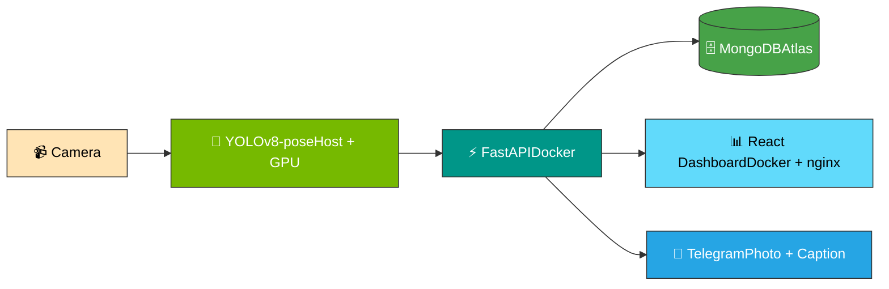

<div align="center">

# 🛡️ Real-Time AI Theft Detection Platform

**Pose-based behavioral surveillance with instant Telegram alerts**

[](https://www.python.org/)
[](https://fastapi.tiangolo.com/)
[](https://react.dev/)
[](https://www.mongodb.com/atlas)
[](https://www.docker.com/)
[](https://developer.nvidia.com/cuda-toolkit)
[](https://core.telegram.org/bots)

</div>

---

## 🎯 What it does

Detects suspicious bending posture in real time using YOLOv8 pose estimation, persists every event to MongoDB Atlas, and pushes instant photo alerts to Telegram — all running at **28–30 FPS** on a laptop GPU.

## 🧰 Tech stack

| Layer | Technology |
|---|---|
| 🤖 **AI** | YOLOv8-pose · OpenCV · PyTorch (CUDA 12.1) |
| ⚡ **Backend** | FastAPI · Motor (async MongoDB) · Pydantic |
| 🖥️ **Frontend** | React 19 · TypeScript · Recharts · Tailwind |
| 🗄️ **Database** | MongoDB Atlas (cloud) |
| 🔔 **Notifications** | Telegram Bot API |
| 🐳 **DevOps** | Docker · Docker Compose · Multi-stage builds |
| ☁️ **Future** | Azure Event Hub · Databricks · AKS · Terraform |

## 🏗️ Architecture



## 🚀 Quick start

### Prerequisites
- Docker Desktop (Compose v2.40+)
- For AI inference: NVIDIA GPU + CUDA 12.1 + Python 3.11

### 1️⃣ Clone & configure

```bash
git clone https://github.com/Nizar7kabbaj/theft-detection-platform.git
cd theft-detection-platform
```

Create `backend/.env` with:
```env
MONGODB_URL=mongodb+srv://<user>:<pass>@<cluster>.mongodb.net/
DATABASE_NAME=theft_detection_db
TELEGRAM_BOT_TOKEN=<from @BotFather>
TELEGRAM_CHAT_ID=<your group/chat id>
```

### 2️⃣ Launch the stack 🐳

```bash
docker compose up --build
```

| Service | URL |
|---|---|
| 📊 Dashboard | http://localhost:8080 |
| 📚 API Docs | http://localhost:8000/docs |

### 3️⃣ Run the AI on host (needs GPU + webcam)

```bash
python -m venv venv
venv\Scripts\activate
pip install ultralytics opencv-python
pip install torch torchvision torchaudio --index-url https://download.pytorch.org/whl/cu121
python ai-model/scripts/detect_alert.py --source 1
```

## 💻 Development

### Backend hot-reload (free with `docker compose up`)
The repo ships with `docker-compose.override.yml` that enables `uvicorn --reload` and mounts `./backend/app` as a volume. Edit Python files → server restarts automatically. No rebuild.

### Frontend dev mode
```bash
cd frontend/theft-detection-ui
npm install
npm start
```
→ http://localhost:3000 (faster than rebuilding the nginx image)

## 📅 Roadmap

| Phase | Scope | Status |
|---|---|---|
| 1️⃣ | AI Model — pose detection on webcam | ✅ Done |
| 2️⃣ | FastAPI backend + MongoDB Atlas | ✅ Done |
| 3️⃣ | React dashboard | ✅ Done |
| 4️⃣ | Full integration — Telegram + Docker + Compose | ✅ Done |
| 5️⃣ | Data pipeline — Event Hub, Databricks, Power BI | 🟡 Planned |
| 6️⃣ | Azure deployment — AKS, Terraform, Azure DevOps | 🟡 Planned |

## 📁 Repository structure

```
theft-detection-platform/
├── 🤖 ai-model/                    YOLOv8-pose scripts + outputs
├── ⚡ backend/                     FastAPI service (Dockerized)
│   ├── app/                       Routes, services, schemas
│   └── Dockerfile                 python:3.11-slim, 317 MB
├── 🖥️ frontend/theft-detection-ui/ React 19 dashboard
│   └── Dockerfile                 Multi-stage: node + nginx, 98 MB
├── 🐳 docker-compose.yml           Service orchestration
├── 🛠️ docker-compose.override.yml  Dev hot-reload
└── 📖 README.md
```

## 📊 Performance

| Metric | Value |
|---|---|
| Inference FPS | **28–30** (RTX 3070 Laptop) |
| Backend image | **317 MB** (slim Python 3.11) |
| Frontend image | **98 MB** (multi-stage build, ~92% reduction) |
| Cold start (compose) | **~3 s** |
| Telegram alert latency | **< 2 s** end-to-end |

## 👤 Author

**Nizar Kabbaj** — Portfolio project for **DevOps Azure Data Engineer** role.
🔗 GitHub: [@Nizar7kabbaj](https://github.com/Nizar7kabbaj)

---

<div align="center">

⭐ If you find this project useful, consider starring the repo!

</div>