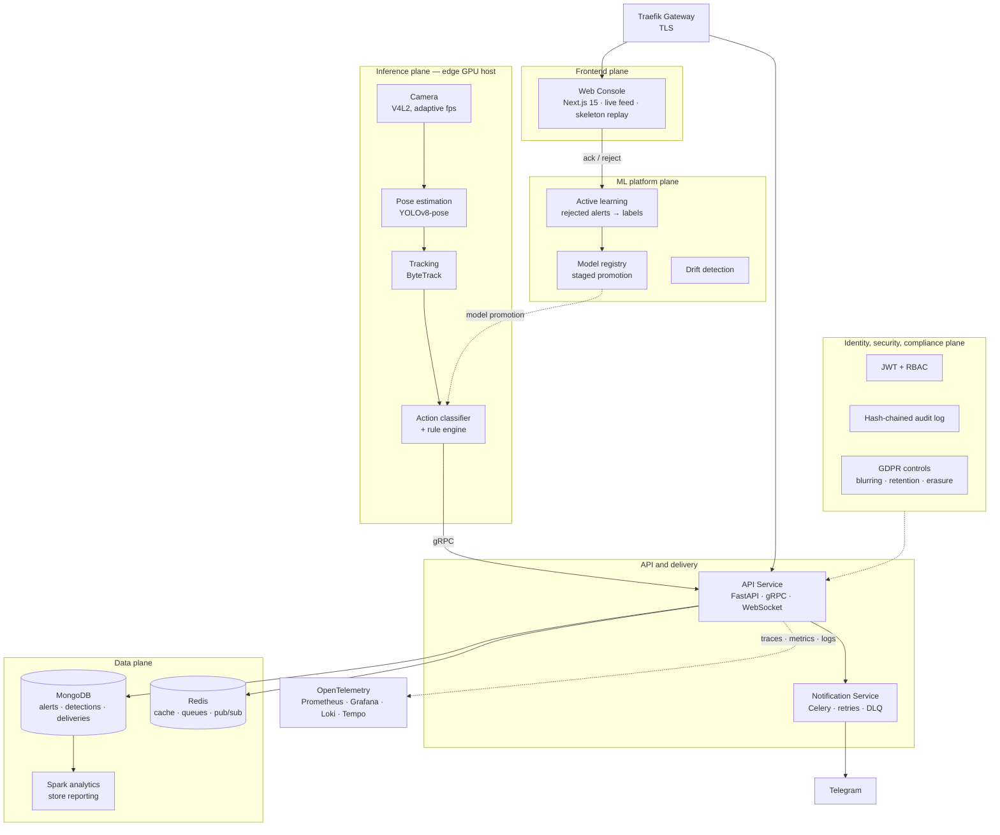

<div align="center">

# Theft Detection Platform

**Real-time theft detection for retail, built as a distributed system.
A behavior classifier reads skeletal motion from the video feed and flags
theft as it happens, alerts reach security staff in under half a second,
and everything from the host OS to the cloud footprint ships as code.**

[](https://www.python.org/)
[](https://fastapi.tiangolo.com/)
[](https://grpc.io/)
[](https://pytorch.org/)
[](https://www.mongodb.com/)
[](https://redis.io/)
[](https://www.docker.com/)
[](https://www.terraform.io/)
[](https://azure.microsoft.com/)
[](https://grafana.com/)
[](https://nextjs.org/)
[](LICENSE)

**Status — academic project, under active development.**
Final-year engineering project (PFE) at **Digital Capital**, in partnership with **ISGA × Aivancity**, 2025–2026 cycle. Not for commercial use.

</div>

---

## Contents

- [Theft Detection Platform](#theft-detection-platform)
  - [Contents](#contents)
  - [What this platform is](#what-this-platform-is)
  - [Architecture](#architecture)
  - [Detection pipeline](#detection-pipeline)
  - [Platform engineering](#platform-engineering)
  - [Getting started](#getting-started)
  - [Repository layout](#repository-layout)
  - [Documentation](#documentation)
  - [License](#license)
  - [Acknowledgments](#acknowledgments)

---

## What this platform is

A surveillance system that recognizes theft behavior from body motion. Pose estimation turns each person in the video feed into a skeletal keypoint sequence, a tracker follows that skeleton across frames, and a learned action classifier decides whether the motion pattern matches theft. When it does, security staff get an alert on Telegram within a 500ms end-to-end budget.

Working on skeletons instead of raw pixels is a deliberate choice. It makes the classifier privacy-friendlier, cheaper to run at the edge, and independent of clothing, lighting, and camera brand. The classifier is trained on shoplifting datasets and sits behind a stable interface, so a stronger model drops in without touching the rest of the system — the detection quality ceiling rises with each training cycle instead of being fixed at design time.

A rule engine runs alongside the classifier as an explainable second signal. Simple human-readable rules catch unambiguous cases (a person bent toward shelves far longer than shopping takes, for example) and give store managers alerts they can reason about directly. Two signals together produce fewer false alarms and fewer missed events than either one alone, and every alert carries its explanation: the rule states why it fired, and the classifier's confidence decomposes into contributing factors.

Around that core sits the rest of the platform: gRPC service contracts, a hardened Linux edge host, Terraform-managed Azure infrastructure, an observability stack with distributed tracing, and an ML pipeline built for retraining, not a frozen checkpoint.

---

## Architecture

The platform is organized into five planes. Each service boundary is a protobuf contract under [`proto/`](proto/), so a service can be rewritten, moved to another host, or scaled out without touching its neighbors.

**Inference plane.** Camera capture, pose estimation (YOLOv8-pose), person tracking, and action classification run close to the camera on a GPU host. A presence gate keeps a lightweight detector always on and wakes the full pipeline only when someone enters the frame, which keeps GPU load proportional to actual store traffic.

**Data plane.** MongoDB stores alerts, detections, and delivery records. Redis backs caching, task queues, and pub/sub fan-out. Alert events flow onward to Spark-based analytics for store-level reporting: peak hours, zone heatmaps, false-alarm trends.

**Identity, security, and compliance plane.** JWT auth with refresh rotation and RBAC, a hash-chained append-only audit log, and privacy controls designed for GDPR: face blurring on stored snapshots, timed retention, and a right-to-erasure endpoint.

**ML platform plane.** Dataset versioning, experiment tracking, a model registry with staged promotion, drift detection on keypoint distributions, and an active-learning loop that turns rejected alerts into labeled training data. This plane is what lets the classifier keep improving on real store footage after deployment.

**Frontend plane.** A Next.js 15 console for security staff: live alert feed over WebSocket, skeleton replay of the pose sequence that triggered each alert, and acknowledge/reject actions that feed the learning loop.


```mermaid
flowchart TB
    subgraph edge["Inference plane — edge GPU host"]
        cam[Camera<br/>V4L2, adaptive fps] --> pose[Pose estimation<br/>YOLOv8-pose]
        pose --> track[Tracking<br/>ByteTrack]
        track --> clf[Action classifier<br/>+ rule engine]
    end

    subgraph data["Data plane"]
        mongo[(MongoDB<br/>alerts · detections · deliveries)]
        redis[(Redis<br/>cache · queues · pub/sub)]
        spark[Spark analytics<br/>store reporting]
    end

    subgraph core["API and delivery"]
        api[API Service<br/>FastAPI · gRPC · WebSocket]
        notif[Notification Service<br/>Celery · retries · DLQ]
    end

    subgraph sec["Identity, security, compliance plane"]
        auth[JWT + RBAC]
        audit[Hash-chained audit log]
        gdpr[GDPR controls<br/>blurring · retention · erasure]
    end

    subgraph mlp["ML platform plane"]
        registry[Model registry<br/>staged promotion]
        drift[Drift detection]
        active[Active learning<br/>rejected alerts → labels]
    end

    subgraph front["Frontend plane"]
        web[Web Console<br/>Next.js 15 · live feed · skeleton replay]
    end

    clf -- gRPC --> api
    api --> mongo
    api --> redis
    api --> notif
    notif --> tg[Telegram]
    mongo --> spark
    traefik[Traefik Gateway<br/>TLS] --> api
    traefik --> web
    web -- ack / reject --> active
    active --> registry
    registry -. model promotion .-> clf
    sec -.-> api
    api -. traces · metrics · logs .-> otel[OpenTelemetry<br/>Prometheus · Grafana · Loki · Tempo]
```

The full component and deployment views live in [`docs/00-architecture.md`](docs/00-architecture.md), with PlantUML sources under [`docs/diagrams/`](docs/diagrams/).

---

## Detection pipeline

A frame travels through five stages between the lens and the guard's phone.

1. **Capture.** V4L2 device handling with automatic recovery on USB disconnect. Frame rate adapts to the scene: 15fps when the store area is empty, 60fps the moment a person enters.
2. **Pose estimation.** YOLOv8-pose extracts skeletal keypoints per person per frame on the local GPU.
3. **Tracking.** ByteTrack assigns stable identities across frames, so behavior is judged per person over time, not per frame.
4. **Classification.** The action classifier scores each tracked pose sequence for theft behavior, with the rule engine running alongside as an independent explainable signal. Input validation on keypoints rejects adversarial or malformed sequences before they reach the model.
5. **Delivery.** Alerts persist to MongoDB first, then ship through a Celery-backed delivery pipeline with retries, exponential backoff, and a dead-letter queue. A notification is never silently lost: it either arrives or leaves an inspectable record of why it didn't.

---

## Platform engineering

**Observability.** Every service is instrumented with OpenTelemetry. Traces flow to Tempo, metrics to Prometheus, logs to Loki via Alloy, and all three meet in Grafana. Trace context survives process boundaries, including Celery task hops, so a single alert can be followed from frame capture to Telegram delivery. A GPU exporter tracks VRAM, temperature, and per-camera FPS. Alertmanager pages on high error rate, low FPS, and disk pressure.

**Security.** The edge host runs hardened Ubuntu 26.04 LTS: ufw default-deny, fail2ban, AppArmor, auditd, unattended upgrades. MongoDB and Redis bind to loopback with auth and persistence configured. Remote access goes through a WireGuard mesh, not exposed ports. Pre-commit hooks run gitleaks, pip-audit, tflint, tfsec, checkov, and conftest on every commit.

**Infrastructure as code.** Terraform 1.10+ with azurerm 4.x manages the Azure footprint from [`infra/terraform/`](infra/terraform/): modules for resource groups, networking, and Key Vault, separate dev and prod environments, and OPA Rego policies enforcing cost control, security baseline, and naming conventions before any plan applies. Auth is Azure AD only, no storage keys. Remote state lives in a backend that survives `terraform destroy`.

**Disaster recovery.** restic-based backups target both external USB and Azure Blob. The restore procedure is a written runbook, drilled end to end against a measured RTO, not a hope.

---

## Getting started

The stack runs on Ubuntu Linux with an NVIDIA GPU. Requirements:

- NVIDIA GPU with CUDA 12.1-compatible drivers
- Docker Engine (native, not Desktop) with `nvidia-container-toolkit`
- Python 3.11 via `pyenv`, Node 20 LTS via `nvm`
- USB webcam (verified with a Logitech C922 Pro)

Clone and prepare local config from the committed examples:

```bash
git clone https://github.com/Nizar7kabbaj/theft-detection-platform.git
cd theft-detection-platform

cp services/api/.env.example services/api/.env
cp ml/.env.example ml/.env
cp config/redis/redis.conf.example config/redis/redis.conf
cp config/prometheus/prometheus.yml.example config/prometheus/prometheus.yml
cp config/alertmanager/alertmanager.yml.example config/alertmanager/alertmanager.yml
cp config/traefik/traefik.yml.example config/traefik/traefik.yml
cp config/traefik/dynamic.yml.example config/traefik/dynamic.yml
./tools/scripts/gen_traefik_certs.sh
```

Fill in the values in both `.env` files before starting the stack. Each variable is documented inline in its example file.

Set up the Python environment for the ML tooling:

```bash
pyenv local 3.11.9
python -m venv venv
source venv/bin/activate
pip install --upgrade pip setuptools wheel
pip install torch torchvision torchaudio \
  --index-url https://download.pytorch.org/whl/cu121
pip install -r ml/requirements.txt
```

The CUDA torch wheel installs before the rest of the requirements. Installing in the other order pulls the CPU-only torch.

Run the stack:

```bash
docker compose \
  -f docker-compose.yml \
  -f docker-compose.override.yml \
  -f docker-compose.linux.yml up -d

curl http://localhost:8001/health
```

Live inference runs on the host, where it has the GPU directly:

```bash
source venv/bin/activate
python ml/scripts/detect_alert.py --source <webcam-index>
```

Stop everything:

```bash
docker compose \
  -f docker-compose.yml \
  -f docker-compose.override.yml \
  -f docker-compose.linux.yml down
```

Azure infrastructure is optional for local work and costs credit while it exists:

```bash
cd infra/terraform/environments/dev
../../scripts/init.sh
../../scripts/plan.sh
../../scripts/apply.sh
../../scripts/destroy.sh
```

---

## Repository layout

```
theft-detection-platform/
├── apps/
│   └── web/           Next.js 15 console (App Router, TypeScript)
├── services/
│   ├── ai/            inference service: pose estimation, tracking, classification
│   ├── api/           FastAPI backend: alerts, auth, WebSocket fan-out
│   └── notification/  Celery delivery pipeline: Telegram, retries, DLQ
├── proto/             protobuf contracts for every service boundary
├── ml/                models, training notebooks, evaluation, inference scripts
├── config/            per-service config: mongo, redis, traefik, observability
├── infra/
│   └── terraform/     Azure IaC: modules, environments, OPA policies
├── ops/
│   └── backup/        restic backup script and excludes
├── tools/
│   ├── calibration/   camera calibration
│   └── scripts/       proto generation, cert generation, smoke tests
├── docs/              architecture and operations chapters, PlantUML diagrams
└── docker-compose*.yml
```

---

## Documentation

The `docs/` tree reads as chapters, in order.

| Chapter | Covers |
|---|---|
| [00-architecture](docs/00-architecture.md) | system design, planes, service contracts |
| [01-linux-setup](docs/01-linux-setup.md) | edge host install and hardening |
| [02-iac-foundation](docs/02-iac-foundation.md) | Terraform structure and Azure modules |
| [03-pre-commit](docs/03-pre-commit.md) | scanner and hook configuration |
| [04-disaster-recovery](docs/04-disaster-recovery.md) | backup strategy, restore runbook, RTO/RPO |
| [05-data-services](docs/05-data-services.md) | MongoDB and Redis setup |
| [06-secrets-management](docs/06-secrets-management.md) | secret storage and rotation |
| [07-observability](docs/07-observability.md) | metrics, logs, traces, dashboards, alerting |
| [08-remote-control](docs/08-remote-control.md) | WireGuard mesh and remote operation |
| [09-camera-pipeline](docs/09-camera-pipeline.md) | capture, calibration, frame transport |

Dataset and model evaluation notes live in [`ml/DATASET.md`](ml/DATASET.md) and [`ml/EVALUATION.md`](ml/EVALUATION.md).

---

## License

MIT. See [LICENSE](LICENSE).

---

## Acknowledgments

- **Digital Capital** — host company for the final-year project
- **ISGA** and **Aivancity** — academic supervision
- **PoseLift** (TeCSAR-UNCC, WACV 2025) — baseline dataset for the first training cycle. [Repository](https://github.com/TeCSAR-UNCC/PoseLift) · [Paper](https://arxiv.org/abs/2501.06591)
- **Ultralytics YOLOv8** — pose estimation backbone
