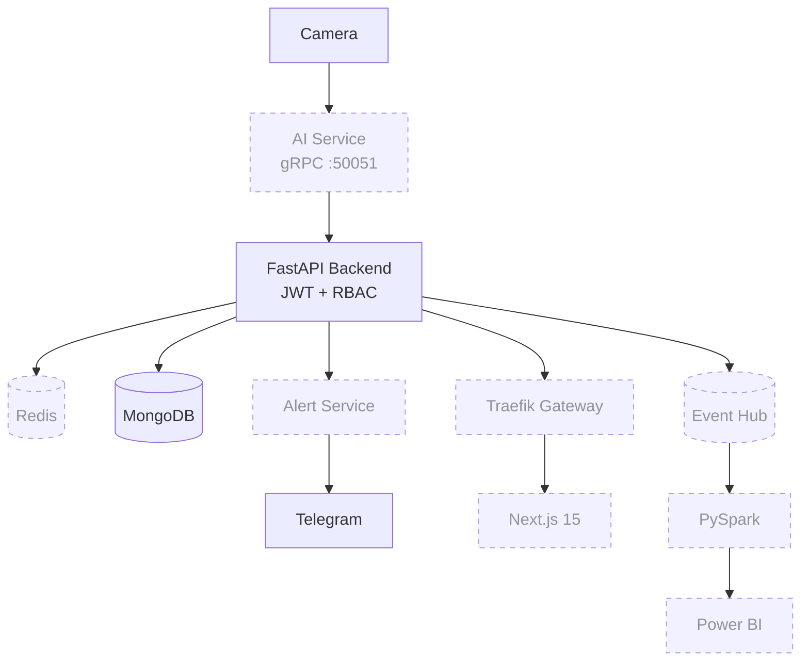

<div align="center">

# Theft Detection Platform

**Real-time pose-based theft detection for retail. A behavior classifier and an explainable rule run on a laptop GPU, alerts ship to a secure messaging channel, and the infrastructure ships as code.**

[](https://www.python.org/)
[](https://www.terraform.io/)
[](https://ubuntu.com/)
[](LICENSE)

</div>

<div align="center">

**Status — academic project, work in progress.**
Final-year engineering project (PFE) at **Digital Capital**, in partnership with **ISGA × Aivancity**, 2025–2026 cycle. Not production-ready. Not for commercial use.

</div>

---

## Contents

- [Theft Detection Platform](#theft-detection-platform)
  - [Contents](#contents)
  - [What this platform is](#what-this-platform-is)
  - [Tech stack](#tech-stack)
  - [Build status](#build-status)
    - [Working today](#working-today)
    - [Planned across the remaining sprints](#planned-across-the-remaining-sprints)
  - [Target architecture](#target-architecture)
  - [Local development](#local-development)
    - [Prerequisites](#prerequisites)
    - [First-time setup](#first-time-setup)
    - [Run the stack](#run-the-stack)
    - [Stop the stack](#stop-the-stack)
    - [Infrastructure (optional, costs Azure credit)](#infrastructure-optional-costs-azure-credit)
  - [Repository layout](#repository-layout)
  - [License](#license)
  - [Acknowledgments](#acknowledgments)

---

## What this platform is

A surveillance system that watches a video feed, detects suspicious posture using pose estimation plus a learned behavior classifier, and delivers alerts to security staff over a secure channel.

The detection logic is hybrid by intent. One human-readable rule catches the easy cases, like a person bending toward shelves for an unusually long time. A machine-learned classifier catches the patterns the rule misses. Two signals together cut both false alarms and missed events compared to either alone.

Around that core sits a full engineering build: a hardened Linux host, Terraform-managed Azure infrastructure, container orchestration, an MLOps pipeline, a security stack, observability, big-data analytics, and explainability tooling.

The work is planned across 14 three-week sprints. Two are done. Twelve remain.

---

## Tech stack

The full technology surface of the platform. Some pieces run today, others land in later sprints (see [Build status](#build-status) for what's working now).

**Languages and runtimes**

[](https://www.python.org/)
[](https://www.typescriptlang.org/)
[](https://nodejs.org/)

**AI and ML**

[](https://pytorch.org/)
[](https://developer.nvidia.com/cuda-toolkit)
[](https://onnx.ai/)
[](https://mlflow.org/)

**Backend**

[](https://fastapi.tiangolo.com/)
[](https://docs.pydantic.dev/)

**Frontend**

[](https://nextjs.org/)
[](https://tailwindcss.com/)

**Data and messaging**

[](https://www.mongodb.com/atlas)
[](https://redis.io/)
[](https://spark.apache.org/)
[](https://core.telegram.org/bots)

**Containers and orchestration**

[](https://www.docker.com/)
[](https://kubernetes.io/)
[](https://helm.sh/)
[](https://istio.io/)
[](https://argo-cd.readthedocs.io/)

**Infrastructure and cloud**

[](https://www.terraform.io/)
[](https://azure.microsoft.com/)
[](https://traefik.io/)

**Observability**

[](https://prometheus.io/)
[](https://grafana.com/)
[](https://opentelemetry.io/)

**CI/CD and OS**

[](https://github.com/features/actions)
[](https://ubuntu.com/)

---

## Build status

### Working today

**Operating system.** Ubuntu 26.04 LTS dual-boot, hardened with `ufw`, `fail2ban`, `AppArmor`, `auditd`, `unattended-upgrades`, and `logrotate`.

**Runtime.** Docker Engine native plus NVIDIA container toolkit and CUDA 12.1, `pyenv` with Python 3.11.9, `nvm` with Node 20 LTS.

**Infrastructure as code.** Terraform 1.10+ with three Azure modules (resource group, networking, security). AAD-only auth, no storage keys, remote state backend that survives `terraform destroy`.

**Policy as code.** Three OPA Rego policies (cost control, security baseline, naming conventions) plus Sentinel reference specs.

**Pre-commit scanners.** `terraform fmt`, `tflint`, `tfsec`, `checkov`, `conftest`.

**Disaster recovery.** `restic`-based backup script with USB and Azure Blob targets, full DR runbook, restore drill executed end to end.

**Application baseline.** YOLOv8 pose detection, bend-rule alert, LSTM classifier overlay, FastAPI backend, MongoDB Atlas storage, Telegram delivery. Carried over from the pre-Linux era. Runs on the new host unchanged.

### Planned across the remaining sprints

**Platform services and observability.** Prometheus, Grafana, Loki, OpenTelemetry-instrumented FastAPI, GPU exporter, Alertmanager.

**MLOps pipeline.** DVC dataset versioning on Azure Blob, MLflow tracking server with Model Registry, reproducible training pipeline, data validation with Great Expectations.

**ML rebuild.** Cross-dataset evaluation on UCF-Crime, data augmentation, transformer baselines (VideoMAE, TimeSformer, PoseFormer), comparative study, confidence calibration, drift detection, Model Card. ST-GCN promoted to primary classifier. ONNX export, NTU RGB+D 120 pretraining, knowledge distillation, federated-learning prototype with Flower.

**Backend microservices split.** FastAPI Backend, gRPC AI Service on `:50051`, Alert Service with Celery, Traefik gateway. Motor async MongoDB driver, Pydantic v2, Redis cache, WebSocket fan-out, offline mode. Sub-500ms end-to-end latency gate enforced in CI.

**Frontend rebuild.** Next.js 15 with App Router, TypeScript strict mode, Tailwind 4, shadcn/ui. Security headers, HttpOnly cookie auth, accessibility. Full test pyramid. Progressive Web App with push notifications. Three-language i18n (French, Arabic with RTL, English).

**Security hardening.** JWT with refresh rotation, RBAC, failed-login lockout, rate limiting, OWASP security headers middleware. Hash-chained audit log. Model weights moved to Azure Blob with SAS and SHA256 verify. Key Vault with Managed Identity. Container supply chain (Trivy, Cosign, SBOM). Adversarial ML defense, signed Telegram webhooks, face blurring, GDPR retention, right-to-erasure endpoint, AI Act compliance docs.

**Containers and orchestration.** Multi-stage Dockerfiles, local Kubernetes via kind, Helm chart, Horizontal Pod Autoscaler, Istio mTLS, NetworkPolicies, probes.

**CI/CD and GitOps.** GitHub Actions (lint, test, build, scan, sign), ArgoCD app-of-apps, Argo Rollouts canary.

**Azure deployment.** Terraform modules for ACR, AKS with GPU node pool, Azure Cache for Redis, Event Hub, Storage, Key Vault, Front Door plus WAF, private endpoints, budget alerts.

**SRE.** Locust load test, chaos engineering, SLOs, error budgets, incident response runbook.

**Big data and analytics.** PySpark and Delta Lake ETL, synthetic multi-store dataset, K-Means behavior clustering, auto-generated weekly business report.

**Linux performance and remote control.** Low-latency kernel, WireGuard VPN mesh, Netdata, Portainer, camera calibration, adaptive frame rate, CUDA persistence.

**Explainability.** Skeleton replay viewer, confidence decomposition, false-alarm feedback loop into active learning.

---

## Target architecture


```mermaid
flowchart TB
    cam[Camera] --> ai[AI Service<br/>gRPC :50051]
    ai --> be[FastAPI Backend<br/>JWT + RBAC]
    be --> redis[(Redis)]
    be --> mongo[(MongoDB)]
    be --> eh[(Event Hub)]
    be --> alert[Alert Service]
    alert --> tg[Telegram]
    be --> traefik[Traefik Gateway]
    traefik --> fe[Next.js 15]
    eh --> spark[PySpark]
    spark --> bi[Power BI]

    classDef planned stroke-dasharray: 5 5,opacity:0.7
    class ai,redis,eh,alert,traefik,fe,spark,bi planned
```

Solid lines run today. Dashed lines are planned across the next twelve sprints.

---

## Local development

This stack runs on **Ubuntu 26.04 LTS only**. The Windows configuration from the project's early days is no longer maintained.

### Prerequisites

- NVIDIA GPU with CUDA 12.1-compatible drivers
- Docker Engine 29+ (native, not Desktop) with `nvidia-container-toolkit` as the default runtime
- Python 3.11.9 via `pyenv`
- Node 20 LTS via `nvm`
- External USB webcam (verified: Logitech C922 Pro)

### First-time setup

```bash
git clone https://github.com/Nizar7kabbaj/theft-detection-platform.git
cd theft-detection-platform

cp backend/.env.example backend/.env
# Fill in MongoDB Atlas URL, Telegram bot token, etc.

pyenv local 3.11.9
python -m venv venv
source venv/bin/activate
pip install --upgrade pip setuptools wheel

# CUDA 12.1 torch wheel must install BEFORE ultralytics,
# otherwise ultralytics pulls the CPU-only torch.
pip install torch torchvision torchaudio \
  --index-url https://download.pytorch.org/whl/cu121
pip install -r ai-model/requirements.txt
```

### Run the stack

```bash
docker compose \
  -f docker-compose.yml \
  -f docker-compose.override.yml \
  -f docker-compose.linux.yml up -d

curl http://localhost:8000/health

# Live AI inference on the host (needs the GPU directly)
source venv/bin/activate
python ai-model/scripts/detect_alert.py --source <webcam-index>
```

### Stop the stack

```bash
docker compose \
  -f docker-compose.yml \
  -f docker-compose.override.yml \
  -f docker-compose.linux.yml down
```

### Infrastructure (optional, costs Azure credit)

```bash
cd infrastructure/terraform/environments/dev
../../scripts/init.sh
../../scripts/plan.sh
../../scripts/apply.sh
# When done demoing:
../../scripts/destroy.sh
```

---

## Repository layout

```
theft-detection-platform/
├── ai-model/        pose detection, behavior classifier, evaluation
├── backend/         FastAPI service (Dockerised)
├── frontend/        Next.js 15 skeleton
├── infrastructure/
│   ├── terraform/   IaC: modules, environments, policies
│   ├── backup/      restic backup script
│   └── azure/       cost-discipline notes
├── docs/
│   ├── 01-linux-setup.md
│   ├── 02-iac-foundation.md
│   ├── 03-pre-commit.md
│   ├── 04-disaster-recovery.md
│   └── compliance/  privacy, limitations, bias
├── docker-compose.yml
├── docker-compose.override.yml
├── docker-compose.linux.yml
├── .pre-commit-config.yaml
└── LICENSE
```

The `frontend/` tree is a skeleton today. Every leaf is a `.gitkeep`. Real code lands during the frontend rebuild sprint.

---

## License

MIT. See [LICENSE](LICENSE).

---

## Acknowledgments

- **Digital Capital** — host company for the final-year project
- **ISGA** and **Aivancity** — academic supervision
- **PoseLift** (TeCSAR-UNCC, WACV 2025) — baseline dataset used in the first training cycle. [Repository](https://github.com/TeCSAR-UNCC/PoseLift). [Paper](https://arxiv.org/abs/2501.06591).
- **Ultralytics YOLOv8** — pose estimation backbone
