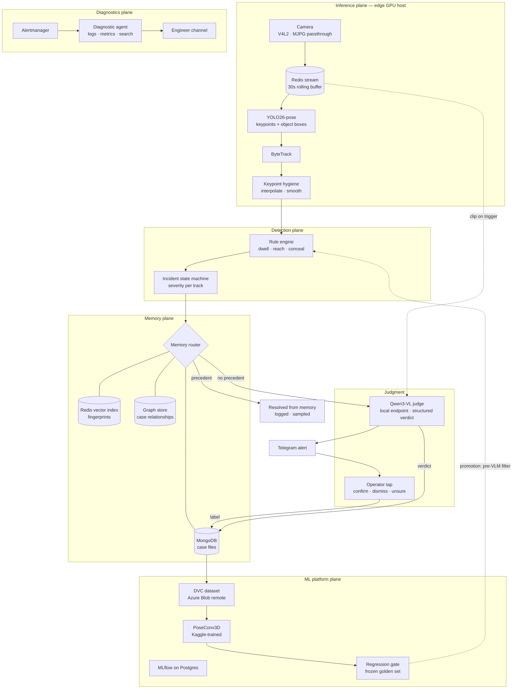

<div align="center">

# Theft Detection Platform

**Real-time theft detection for retail, built as a distributed system.
A three-stage cascade reads skeletal motion and object cues from the video
feed, checks new incidents against a memory of past cases, calls a local
vision-language model only when precedent can't settle it, and puts the
final word in a human's hands. Alerts reach security staff in under half
a second, every verdict carries its reason, and the system labels its own
training data as it runs — each store grows a model trained on its own
camera, its own light, its own shelves.**

[](https://www.python.org/)
[](https://fastapi.tiangolo.com/)
[](https://grpc.io/)
[](https://pytorch.org/)
[](https://developer.nvidia.com/tensorrt)
[](https://github.com/QwenLM)
[](https://www.mongodb.com/)
[](https://redis.io/)
[](https://www.docker.com/)
[](https://www.terraform.io/)
[](https://azure.microsoft.com/)
[](https://mlflow.org/)
[](https://dvc.org/)
[](https://grafana.com/)
[](https://nextjs.org/)
[](LICENSE)

**Status — academic project, under active development.**
Final-year engineering project (PFE) at **Digital Capital**, in partnership with **ISGA × Aivancity**, 2025–2026 cycle. Not for commercial use.

</div>

---

## Contents

- [Theft Detection Platform](#theft-detection-platform)
  - [Contents](#contents)
  - [What this platform is](#what-this-platform-is)
  - [Why a per-store model](#why-a-per-store-model)
  - [Architecture](#architecture)
  - [Detection pipeline](#detection-pipeline)
  - [The memory layer](#the-memory-layer)
  - [The data flywheel](#the-data-flywheel)
  - [Self-diagnosis](#self-diagnosis)
  - [Platform engineering](#platform-engineering)
  - [Getting started](#getting-started)
  - [Repository layout](#repository-layout)
  - [Documentation](#documentation)
  - [License](#license)
  - [Acknowledgments](#acknowledgments)

---

## What this platform is

A surveillance system that recognizes theft behavior from body motion and object movement, organized as a cascade where each stage is cheaper than the one after it and no stage makes a call above its pay grade.

The first stage is a rule engine reading skeletal keypoints and object boxes — dwell time, reach-toward-body, object-in-hand followed by object-vanish. It fires early and often by design: its job is recall, not precision. The second stage is a memory router. Before any expensive judgment, the incident is fingerprinted and compared against past cases; a strong, consistent precedent resolves it on the spot, in either direction. Only incidents without precedent reach the third stage, a vision-language model (Qwen3-VL) running on the local GPU behind an OpenAI-compatible endpoint. It reads the actual pixels of the clip and returns a structured verdict — class, confidence, and a plain-language reason. The verdict lands on Telegram, where an operator confirms, dismisses, or flags it unsure. That tap is the last word, and it is also a label: every human-verified case enters the training set.

The system judges behavior, never identity. Detection runs on skeletons, motion, and objects; faces are blurred before any frame persists and no face ever reaches storage or an alert. There is no face recognition and no per-person profiling anywhere in the pipeline.

Around the cascade sits the rest of the platform: gRPC service contracts, a hardened Linux edge host, Terraform-managed Azure infrastructure, an observability stack with distributed tracing, a versioned ML pipeline built for retraining, and a diagnostic agent that reads the system's own logs and metrics when something breaks and reports the likely cause.

---

## Why a per-store model

Models trained on public shoplifting datasets degrade badly on a camera they were not filmed with. Each public dataset carries its own camera height, lens, lighting, and shelf geometry; a classifier that scores well on the benchmark can fall apart on a different mounting. The first training cycle here, an LSTM on public pose data, showed exactly that gap on live footage.

The platform's answer is to stop depending on other people's cameras. The camera is fixed, the store is fixed, and every confirmed alert produces one labeled example from the exact distribution the model serves in — the vision-language model judges, the human confirms, and the clip files itself into the store's own dataset with no manual annotation. Once enough verified cases accumulate, a PoseConv3D classifier fine-tunes on them and joins the cascade as a filter ahead of the vision-language model, dropping the easy negatives cheaply. Each store ends up with a model trained on its own footage, and the model improves for as long as the system runs. Public datasets serve as bootstrap material only.

---

## Architecture

The platform is organized into planes. Each service boundary is a protobuf contract under [`proto/`](proto/), so a service can be rewritten, moved to another host, or given a different implementation without touching its neighbors.

**Inference plane.** Camera capture publishes native MJPG onto a Redis stream that doubles as a rolling 30-second pre-trigger buffer. YOLO26-pose extracts skeletal keypoints and object boxes (bottle, phone, bag) in a single pass; its NMS-free head keeps per-frame cost flat regardless of crowding. ByteTrack assigns stable identities, a keypoint hygiene pass interpolates gaps and smooths jitter, and a presence gate keeps GPU load proportional to store traffic. The pose model serves as a TensorRT FP16 engine; the vision-language model shares the card in the leftover VRAM under a lower-priority cgroup slice, so judgment never starves the eyes.

**Detection plane.** The rule engine, the per-track incident state machine (severity escalates from a single fire through conceal-then-move to conceal-and-exit), zone calibration mapping track positions to aisle, shelf edge, and exit polygons, and clip extraction that samples densely around the trigger moment — the concealment has to be inside the frames the judge sees.

**Memory plane.** MongoDB holds the permanent case file per incident: clip reference (faces blurred), motion signature, verdict, reason, zone, timestamp, and the human's tap. A Redis vector index holds incident fingerprints for similarity recall, and a graph store beside MongoDB holds the relationships between cases — same track across visits, same zone, prior incidents — so repeat patterns surface as connected incidents, not isolated events. The memory router reads all three.

**Data plane.** MongoDB for alerts, detections, and delivery records; Redis in three separated roles — frame stream, task broker, vector catalog — each with its own ACL users and its own memory policy.

**ML platform plane.** DVC versions the dataset against an Azure Blob remote, MLflow on Postgres tracks every run, Pandera validates every sample at the door, and training runs on Kaggle from a PYSKL pretrained checkpoint — the edge host serves, it never trains. A regression gate blocks any model that fails to beat the incumbent on a frozen golden evaluation set, and confidence is temperature-calibrated before an operating point is picked.

**Diagnostics plane.** Alertmanager feeds a diagnostic agent that pulls the relevant logs from Loki, metrics from Prometheus, and traces from Tempo, forms a single hypothesis with a confidence, and reports it to an engineer-only channel — with a web-search tool for unknown error signatures and a memory of past failures so repeat incidents arrive with their known fix attached. It recommends; it never executes.

**Identity, security, and compliance plane.** JWT auth with refresh rotation and RBAC, a hash-chained append-only audit log, and privacy controls designed for GDPR and the EU AI Act: face blurring before persistence, timed retention, a right-to-erasure endpoint, and a model card stating intended use, measured limits, and fairness checks.

**Frontend plane.** A Next.js 15 console for security staff: live alert feed over WebSocket, skeleton replay of the pose sequence behind each alert, and acknowledge/reject actions that feed the learning loop.


```mermaid
flowchart TB
    subgraph edge["Inference plane — edge GPU host"]
        cam[Camera<br/>V4L2 · MJPG passthrough] --> stream[(Redis stream<br/>30s rolling buffer)]
        stream --> pose[YOLO26-pose<br/>keypoints + object boxes]
        pose --> track[ByteTrack] --> hygiene[Keypoint hygiene<br/>interpolate · smooth]
    end

    subgraph detect["Detection plane"]
        hygiene --> rules[Rule engine<br/>dwell · reach · conceal]
        rules --> incident[Incident state machine<br/>severity per track]
    end

    subgraph memory["Memory plane"]
        router{Memory router}
        vec[(Redis vector index<br/>fingerprints)]
        cases[(MongoDB<br/>case files)]
        graphdb[(Graph store<br/>case relationships)]
        router --- vec
        router --- cases
        router --- graphdb
    end

    subgraph judge["Judgment"]
        vlm[Qwen3-VL judge<br/>local endpoint · structured verdict]
        human[Operator tap<br/>confirm · dismiss · unsure]
    end

    subgraph flywheel["ML platform plane"]
        dvc[DVC dataset<br/>Azure Blob remote]
        mlf[MLflow on Postgres]
        p3d[PoseConv3D<br/>Kaggle-trained]
        gate[Regression gate<br/>frozen golden set]
    end

    subgraph diag["Diagnostics plane"]
        am[Alertmanager] --> doctor[Diagnostic agent<br/>logs · metrics · search]
        doctor --> ops[Engineer channel]
    end

    incident --> router
    router -- precedent --> resolved[Resolved from memory<br/>logged · sampled]
    router -- no precedent --> vlm
    vlm --> tg[Telegram alert] --> human
    human -- label --> cases
    vlm -- verdict --> cases
    cases --> dvc --> p3d --> gate
    gate -. promotion: pre-VLM filter .-> rules
    stream -. clip on trigger .-> vlm
```

The full component and deployment views live in [`docs/00-architecture.md`](docs/00-architecture.md), with PlantUML sources under [`docs/diagrams/`](docs/diagrams/).

---

## Detection pipeline

A frame travels from the lens to the guard's phone through two clocks.

1. **Capture.** V4L2 device handling with automatic recovery on USB disconnect. Native MJPG passes straight from the device onto the Redis stream — no decode/re-encode. Frame rate adapts to the scene through the presence gate.
2. **Perception.** YOLO26-pose extracts keypoints and object boxes in one pass on the local GPU; ByteTrack holds identities across frames; the hygiene pass fills keypoint gaps and smooths jitter before anything downstream reads them.
3. **Rules.** The tripwire scores dwell, reach-toward-body, and object-in-hand/object-vanish per track. Fires accumulate in the incident state machine; severity escalates as concealment turns to movement and movement turns toward the exit.
4. **Fast clock.** On a trigger, a provisional alert reaches Telegram in under 500ms through the Celery delivery pipeline — retries, exponential backoff, dead-letter queue. An alert either arrives or leaves an inspectable record of why it didn't.
5. **Slow clock.** The memory router fingerprints the incident and pulls the nearest past cases. Strong consistent precedent resolves it; anything else goes to the vision-language model, which reads frames sampled densely around the trigger and returns a schema-enforced verdict with its reason. The verdict upgrades the provisional alert to confirmed, dismissed, or timed out.
6. **Last word.** The operator's tap closes the case and files the label. Suppressions — cases the memory silenced — are logged append-only, and a sampled fraction still goes through the judge as a spot check. Silence is never unaudited.

---

## The memory layer

Two stores split the work by what each is built for. Redis holds the fast, volatile side: the frame stream, the task broker, and the vector catalog that returns the nearest past cases in milliseconds no matter how large the archive grows. MongoDB holds the permanent side: the full case file per incident, which is simultaneously the audit trail and the training set. The graph store adds the dimension similarity can't express — whether this incident connects to that one through the same track, the same zone, the same pattern across days.

The router in front of them is deliberately plain: thresholds, not a language model deciding. When it stays silent, the log answers why with the past cases that justified it. Retrieval quality is measured on a held-out set — the risk in a memory system was never the archive size, it's pulling the wrong five cases.

---

## The data flywheel

Every confirmed alert writes three things: a case file to MongoDB, a fingerprint to the vector index, and a labeled sample toward the next training cycle. Pandera validates keypoint schema and clip bounds before anything enters the dataset; DVC versions each snapshot against Azure Blob; MLflow records which data, which parameters, which score. Training runs on Kaggle from a PYSKL pretrained PoseConv3D checkpoint — checkpointed per epoch, resumable across the session cap — and the resulting model sits its exam against the frozen golden set before promotion. Promoted, it takes a seat between the rules and the vision-language model, dropping easy negatives at skeleton cost. It never makes the final call; it can't see the object.

The golden set itself is built to resist self-deception: hard negatives — innocent actions that look like theft — with frozen ground truth that thresholds are never tuned against. Judge prompts are versioned like code, and every prompt change re-scores against the set; a regression fails the change.

---

## Self-diagnosis

A detection system that fails silently is worse than none, so the platform watches itself with the same cascade shape it uses on the shop floor. Prometheus rules — container down, latency budget breach, low VRAM headroom, keypoint drift from the per-session KS-test — fire into Alertmanager, which wakes the diagnostic agent. The agent pulls the logs, metrics, and traces around the alert, forms one hypothesis with a stated confidence, and posts it to an engineer-only Telegram channel, kept fully separate from the store's alert feed. Unknown error signatures go through a web-search tool and come back with the relevant issue thread linked. Every diagnosis files into a failure memory, so a repeat incident arrives with its precedent: when it last happened, what fixed it, whether the fix held.

Model updates run through the same discipline as everything else. When a new vision-language model or pose model releases, the agent evaluates it against the golden set overnight in the low-priority GPU slice and reports the numbers; the swap happens only on an engineer's approval, and only as a configuration change — the judge speaks to an OpenAI-compatible local endpoint, so backends exchange without code changes. Nothing updates itself.

---

## Platform engineering

**Observability.** Every service is instrumented with OpenTelemetry. Traces flow to Tempo, metrics to Prometheus, logs to Loki via Alloy, and all three meet in Grafana. Trace context survives process boundaries, including Celery task hops, so a single alert can be followed from frame capture to Telegram delivery. A GPU exporter tracks VRAM, temperature, and per-camera FPS.

**Security.** The edge host runs hardened Ubuntu: ufw default-deny, fail2ban, AppArmor, auditd with an immutable rule set, unattended upgrades. MongoDB and the three Redis roles bind to loopback with per-service ACL users, hashed passwords in config, and plaintext only in 600-mode files owned by the container user. Model weights verify against published hashes before first load. The vision-language endpoint is reachable only on the internal Docker network. Remote access goes through a WireGuard mesh, not exposed ports. Pre-commit hooks run gitleaks, pip-audit, tflint, tfsec, checkov, and conftest on every commit, and service images build non-root with vulnerability scanning in CI. Telegram commands are gated by an operator whitelist, rate-limited, and audit-logged — a muted zone is a chosen blind spot, and the log says who chose it.

**Infrastructure as code.** Terraform 1.10+ with azurerm 4.x manages the Azure footprint from [`infra/terraform/`](infra/terraform/): modules for resource groups, networking, and Key Vault, separate dev and prod environments, and OPA Rego policies enforcing cost control, security baseline, and naming conventions before any plan applies. Auth is Azure AD only, no storage keys. Remote state lives in a backend that survives `terraform destroy`.

**Disaster recovery.** restic-based backups target both external USB and Azure Blob. The restore procedure is a written runbook, drilled end to end against a measured RTO, not a hope.

---

## Getting started

The stack runs on Ubuntu Linux with an NVIDIA GPU. Requirements:

- NVIDIA GPU with CUDA-compatible drivers (verified on an RTX 3070, 8GB)
- Docker Engine (native, not Desktop) with `nvidia-container-toolkit`
- Python 3.11 via `pyenv`, Node 20 LTS via `nvm`
- USB webcam (verified with a Logitech C922 Pro)

Clone and prepare local config from the committed examples:

```bash
git clone https://github.com/Nizar7kabbaj/theft-detection-platform.git
cd theft-detection-platform

cp services/api/.env.example services/api/.env
cp ml/.env.example ml/.env
cp config/redis/redis.conf.example config/redis/redis.conf
cp config/redis/redis-stream.conf.example config/redis/redis-stream.conf
cp config/redis/redis-broker.conf.example config/redis/redis-broker.conf
cp config/prometheus/prometheus.yml.example config/prometheus/prometheus.yml
cp config/alertmanager/alertmanager.yml.example config/alertmanager/alertmanager.yml
cp config/traefik/traefik.yml.example config/traefik/traefik.yml
cp config/traefik/dynamic.yml.example config/traefik/dynamic.yml
./tools/scripts/gen_traefik_certs.sh
```

Fill in the values in both `.env` files before starting the stack. Each variable is documented inline in its example file.

Set up the Python environment for the ML tooling:

```bash
pyenv local 3.11.9
python -m venv venv
source venv/bin/activate
pip install --upgrade pip setuptools wheel
pip install torch torchvision torchaudio \
  --index-url https://download.pytorch.org/whl/cu121
pip install -r ml/requirements.txt
```

The CUDA torch wheel installs before the rest of the requirements. Installing in the other order pulls the CPU-only torch.

Run the stack:

```bash
docker compose \
  -f docker-compose.yml \
  -f docker-compose.override.yml \
  -f docker-compose.linux.yml up -d

curl http://localhost:8001/health
```

The compose profiles split the stack: the `ai` profile runs capture, inference, and detection; the observability profile brings up the metrics, logging, and tracing services when dashboards are needed.

Stop everything:

```bash
docker compose \
  -f docker-compose.yml \
  -f docker-compose.override.yml \
  -f docker-compose.linux.yml down
```

Azure infrastructure is optional for local work and costs credit while it exists:

```bash
cd infra/terraform/environments/dev
../../scripts/init.sh
../../scripts/plan.sh
../../scripts/apply.sh
../../scripts/destroy.sh
```

---

## Repository layout

```
theft-detection-platform/
├── apps/
│   └── web/           Next.js 15 console (App Router, TypeScript)
├── services/
│   ├── ai/            inference: pose, tracking, rules, incident state
│   ├── api/           FastAPI backend: alerts, auth, WebSocket fan-out
│   ├── camera/        V4L2 capture, MJPG publisher, USB recovery
│   ├── detect-gate/   presence gate reading the frame stream
│   └── notification/  Celery delivery pipeline: Telegram, retries, DLQ
├── proto/             protobuf contracts for every service boundary
├── ml/                models, training notebooks, evaluation, inference scripts
├── config/            per-service config: mongo, redis, telegram, observability
├── infra/
│   └── terraform/     Azure IaC: modules, environments, OPA policies
├── ops/
│   ├── backup/        restic backup script and excludes
│   └── host/gpu/      persistence and clock-lock units for the edge GPU
├── tools/
│   ├── calibration/   camera calibration
│   ├── scripts/       proto generation, cert generation, preflight checks
│   └── smoke/         end-to-end smoke tests
├── fixtures/          test clips for the presence gate
├── docs/              architecture and operations chapters, PlantUML diagrams
└── docker-compose*.yml
```

---

## Documentation

The `docs/` tree reads as chapters, in order.

| Chapter | Covers |
|---|---|
| [00-architecture](docs/00-architecture.md) | system design, planes, service contracts |
| [01-linux-setup](docs/01-linux-setup.md) | edge host install and hardening |
| [02-iac-foundation](docs/02-iac-foundation.md) | Terraform structure and Azure modules |
| [03-pre-commit](docs/03-pre-commit.md) | scanner and hook configuration |
| [04-disaster-recovery](docs/04-disaster-recovery.md) | backup strategy, restore runbook, RTO/RPO |
| [05-data-services](docs/05-data-services.md) | MongoDB and Redis setup |
| [06-secrets-management](docs/06-secrets-management.md) | secret storage and rotation |
| [07-observability](docs/07-observability.md) | metrics, logs, traces, dashboards, alerting |
| [08-remote-control](docs/08-remote-control.md) | WireGuard mesh and remote operation |
| [09-camera-pipeline](docs/09-camera-pipeline.md) | capture, calibration, frame transport |
| [10-frame-transport](docs/10-frame-transport.md) | MJPG passthrough and the Redis frame stream |
| [11-detect-gate](docs/11-detect-gate.md) | presence gate design and stream consumption |
| [12-multi-camera-coordination](docs/12-multi-camera-coordination.md) | camera identity and zone ownership |
| [13-gpu-baseline](docs/13-gpu-baseline.md) | GPU measurement, persistence, clock locking |
| [14-vlm-judge-spike](docs/14-vlm-judge-spike.md) | VLM judge probe, composite tile input, measured scope |

Dataset and model evaluation notes live in [`ml/DATASET.md`](ml/DATASET.md) and [`ml/EVALUATION.md`](ml/EVALUATION.md).

---

## License

MIT. See [LICENSE](LICENSE).

---

## Acknowledgments

- **Digital Capital** — host company for the final-year project
- **ISGA** and **Aivancity** — academic supervision
- **PoseLift** (TeCSAR-UNCC, WACV 2025) — bootstrap dataset for the first training cycle. [Repository](https://github.com/TeCSAR-UNCC/PoseLift) · [Paper](https://arxiv.org/abs/2501.06591)
- **Ultralytics** — YOLO26-pose backbone
- **Qwen team** — Qwen3-VL vision-language model
- **PYSKL** — PoseConv3D pretrained checkpoints
