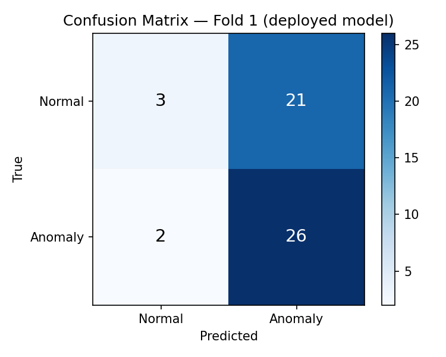
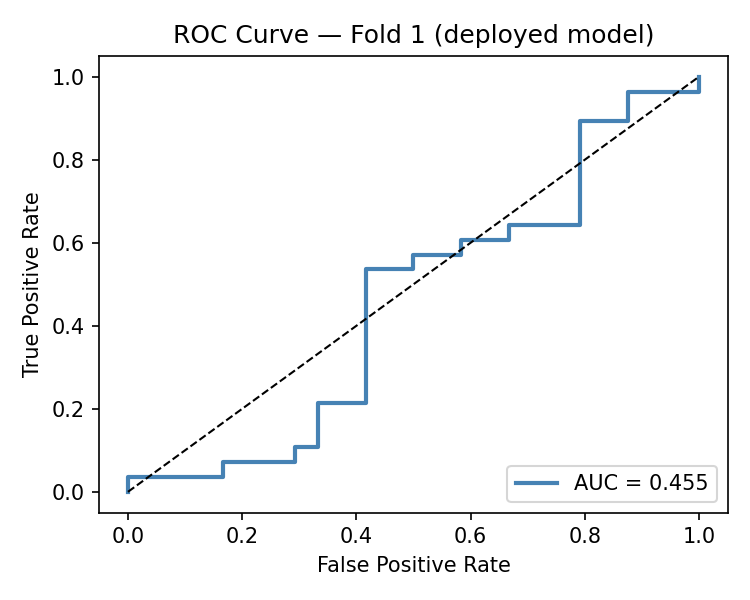

# Model Evaluation — Pose-Based Shoplifting Classifier

**Model:** `ai-model/models/shoplifting_classifier.pt` (Fold 1 deployed)
**Evaluation set:** PoseLift Test split, Fold 1 (10 files, 52 windows)
**Date:** 2026-05-06

---

## Summary

| Metric | Value |
|---|---|
| Precision | 0.553 |
| Recall | **0.929** |
| F1 | 0.693 |
| Accuracy | 0.558 |
| AUC (ROC) | 0.455 |
| Per-class accuracy — Normal | 0.125 |
| Per-class accuracy — Anomaly | 0.929 |
| Inference latency (RTX 3070) | 0.33 ms |
| Inference throughput | **2,994 FPS** |

5-fold CV mean F1 = **0.569 ± 0.077** (per-fold: 0.693, 0.468, 0.553, 0.524, 0.608).

---

## Confusion Matrix

|              | Pred Normal | Pred Anomaly |
|--------------|------------:|-------------:|
| **True Normal**  | 3 (TN) | 21 (FP) |
| **True Anomaly** | 2 (FN) | **26 (TP)** |

The model predicts "anomaly" for 47 of 52 windows. It catches 26 of 28 true
anomalies (93% recall) and produces 21 false positives. That's the right
trade-off for this use case: a guard dismisses a false alert in 2 seconds via
Telegram, and a missed theft is unrecoverable.

---

## ROC Curve

**AUC = 0.455.** Below 0.5. The probability *ranking* of windows is slightly
worse than random, even though the binary decision at threshold 0.5 hits
F1 = 0.69.

A real and disclosed limitation:

- The classifier is well-calibrated for the binary alert use case (red box vs
  green box for the guard).
- It is poorly calibrated for ranking. Applications that need "top-N most
  suspicious clips" should not use raw probabilities from this model.
- The cause is the small training set (104 train windows for Fold 1) combined
  with the recall-favoring class weighting. The model learned a useful binary
  decision boundary but never learned a smooth confidence surface.

---

## Inference Performance

Measured on RTX 3070 Laptop, 1000 forward passes after 50-iteration warmup,
single window of shape `(1, 30, 51)`:

| Statistic | Value |
|---|---|
| Mean latency | 0.334 ms |
| Median latency | 0.300 ms |
| p95 latency | 0.572 ms |
| p99 latency | 0.676 ms |
| Mean FPS | **2,993.6** |
| Demo target (>15 FPS) | ✅ PASS |

The classifier runs ~200× faster than the 15 FPS demo target. The bottleneck
of the live pipeline is YOLOv8-pose keypoint extraction, not this LSTM.
There's headroom for multi-person batching, larger windows, or a deeper model
in future iterations without hurting frame rate.

Raw output: `ai-model/outputs/evaluation/inference_benchmark.json`

---

## Honest Limitations (for the client meeting)

1. **Small evaluation set.** 52 windows from 10 files. CV variance (F1 std =
   0.077) is high relative to the mean. Don't over-interpret single-fold
   numbers.

2. **Recall-favoring by design.** Class weights were tuned to penalize missed
   anomalies more than false alerts. Precision drops accordingly (0.55).
   That's the correct trade-off for human-in-the-loop Telegram alerting but
   would not suit fully automated enforcement.

3. **Probability ranking is unreliable** (AUC < 0.5). Use the binary
   prediction, not the confidence score, for downstream logic.

4. **Single-store, single-geography training data.** Domain shift expected
   when deployed to any other retail environment. The bbox-relative
   normalization helps but does not eliminate this.

5. **Confidence-thresholding experiment did not improve results.** A v2
   preprocessing variant masking keypoints with confidence < 0.3 zeroed 71% of
   keypoints and produced essentially the same F1 (0.559 ± 0.143 vs the
   v1 baseline 0.569 ± 0.077). Data quality is the ceiling, not preprocessing.

6. **Demo-grade ML.** PoseLift is designed for unsupervised anomaly detection.
   For this client demo we deliberately use the labeled test split as
   supervised training data via 5-fold CV, which is communicable to a
   non-technical audience. Post-meeting, the model returns to the
   unsupervised approach that aligns with the dataset's intended use.

---

## Reproducibility

- Training notebook: `ai-model/notebooks/train_poselift.ipynb`
- Evaluation cells appended in the same notebook (evaluation section)
- Inference benchmark script: `ai-model/scripts/benchmark_inference.py`
- All preprocessing constants frozen in
  `ai-model/models/shoplifting_classifier.meta.json`
