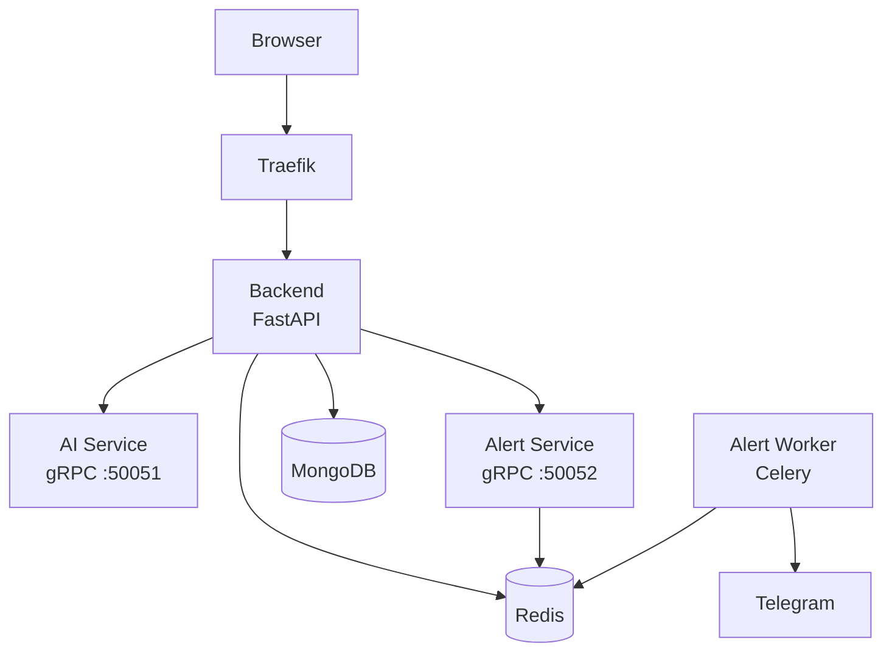
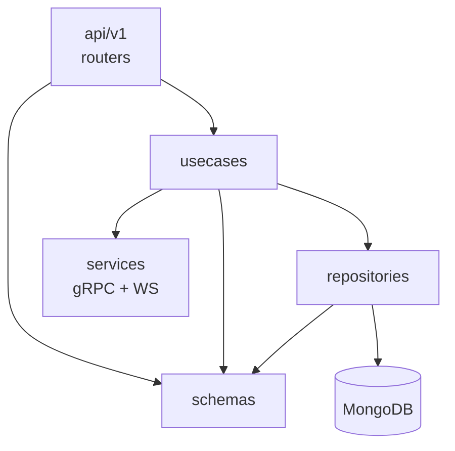
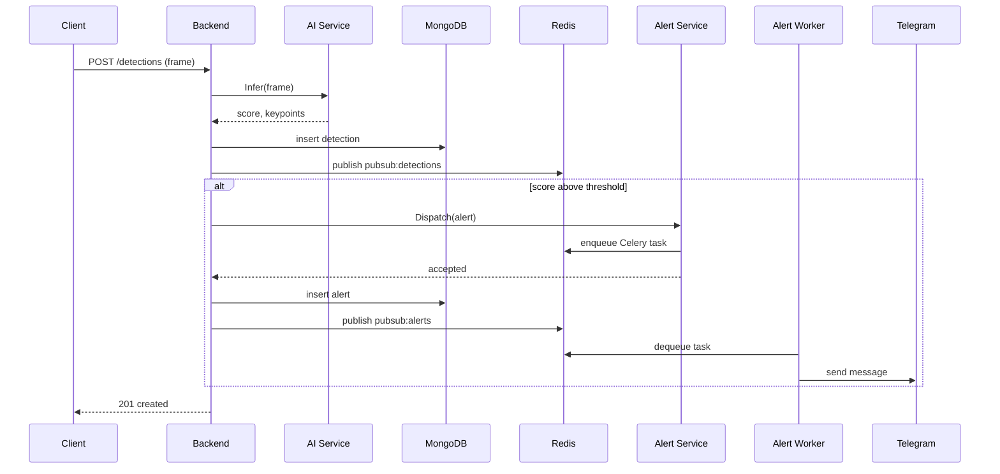

# Backend microservices

## 1. Purpose

The backend tier is the FastAPI process plus the two sibling services it delegates to. The FastAPI process owns the HTTP and WebSocket surface, persists cameras, detections, and alerts to MongoDB through Motor, caches reads in Redis, and publishes state changes onto Redis pubsub channels so the WebSocket layer can fan them out to connected browsers.

It does not run model inference, does not call Telegram, and does not hold model weights. Inference lives in ai-service behind a gRPC contract so the model can be swapped without touching the HTTP surface. Telegram delivery lives in alert-service and an alert-worker Celery process, kept separate so the gRPC dispatch call returns in milliseconds and the slow hop to the Telegram API happens out of band.

## 2. The four services

The backend tier runs as four containers. Traefik fronts every external connection. The FastAPI process talks to the two gRPC services on the internal Docker network. The Celery worker is the only process that reaches the Telegram API.



### 2.1 backend

FastAPI process behind uvicorn. Owns the routes under `/api/v1` (cameras, detections, alerts, stats) and the WebSocket endpoint under `/ws`. Persists through Motor to MongoDB, caches reads in Redis, and publishes state changes onto Redis pubsub channels that the broadcaster fans out to connected clients.

The two outbound gRPC channels are created once during the FastAPI lifespan and reused for the lifetime of the process. Reconnecting per request would add a TCP handshake to every detection — the channels stay open instead, with keepalive set to 30 seconds so dead peers fail fast rather than hang.

Reads and writes MongoDB (cameras, detections, alerts, stats) and Redis (cache plus pubsub). Depends on mongo, redis, ai-service, and alert-service. Exposed on `127.0.0.1:8001` directly and through Traefik on `:80` and `:443`.

### 2.2 ai-service

gRPC server on port 50051. Implements `theftdetection.v1.InferenceService`. Loads the detector at startup, then serves `Infer` calls by running the model on the submitted frame and returning a score with optional keypoints.

The detector sits behind an interface so the model can be replaced without touching the gRPC surface. Inference runs on a thread-pool executor — the asyncio loop hands the GPU work off to a worker thread instead of blocking. Health is reported through the standard gRPC health protocol, set to `NOT_SERVING` while the model loads and flipped to `SERVING` once the detector is ready, so the backend's first call after startup either succeeds or fails fast.

Holds no persistent state. Depends on nothing at runtime — the weights are read from disk at startup. Exposed on `127.0.0.1:50051` for local debugging only; the backend reaches it through the internal Docker network.

### 2.3 alert-service

gRPC server on port 50052. Implements `theftdetection.v1.AlertService`. The `Dispatch` call accepts an alert payload from the backend, validates it, and enqueues a Celery task on Redis. It does not call Telegram itself. That boundary is deliberate — the gRPC call returns in milliseconds and the slow hop to Telegram happens in the worker, out of the backend's request path.

Writes to Redis as the Celery broker. Depends on redis. Exposed on `127.0.0.1:50052` for local debugging only.

### 2.4 alert-worker

Celery worker. Same image as alert-service, different command. Pulls tasks off the Redis broker, formats the payload, and calls the Telegram Bot API. Retries on transient failures with exponential backoff. The worker is the only process in the platform that holds the bot token at runtime.

Dequeues from Redis and calls Telegram. Depends on redis and Telegram reachability. No inbound port — nothing in the cluster connects to it.

alert-service and alert-worker share one image today and split into two when the platform moves to Kubernetes. The boundary between them is already a Redis queue, so the split is a packaging change rather than a refactor.

## 3. Layered architecture inside backend

The FastAPI process is structured in four layers, in `backend/app/`:

```
schemas/        # pydantic v2 models, the only place where shapes are defined
repositories/   # Motor calls, one file per collection
usecases/       # business rules, orchestrate repositories
api/v1/         # FastAPI routers, HTTP and WebSocket entry points
```



The rule is one-directional. Routers depend on usecases, usecases depend on repositories, repositories depend on schemas. Nothing in `schemas/` imports from any of the other three layers. A repository never calls a usecase. A usecase never touches `db.collection.find()` directly — that lives in a repository.

This shape costs more lines than a flat handler-with-Mongo-calls would, but it pays back in three places. Usecases get unit-tested against a fake repository that returns canned objects, with no docker, no event loop, and no Mongo. Repositories get tested directly against a real Mongo on the integration tier. Routers get tested through `httpx.AsyncClient` against the running app, and the only thing they need to know is that the usecase returns the right object — they don't reach into the database to check.

The other layer that lives in the same process but doesn't fit the inward stack is `services/`. It holds adapters to things outside the backend's own data: `inference_service` and `alert_service` wrap the gRPC stubs, and `broadcast_service` owns the WebSocket fan-out plus the Redis pubsub bridge. Usecases call into services the same way they call into repositories — by interface, with the concrete client injected at startup.

## 4. Cross-cutting concerns

Five things in the backend cut across every layer: idempotency, the Redis cache, pubsub channels, observability, and error mapping. Each one is small in isolation but visible from anywhere in the stack, so they live in `app/core/` and the routers, repositories, and usecases reach into them by name.

### 4.1 Idempotency on POST routes

Every POST route under `/api/v1` accepts an optional `Idempotency-Key` header. The dependency lives in `app/core/idempotency.py` and is wired in as a FastAPI `Depends` on the create endpoints for cameras, detections, and alerts.

The first request with a given key runs the handler normally, then stores the response body in Redis under `idem:<route>:<key>` with a 24-hour TTL. A second request with the same key returns the cached response without touching Mongo. Clients that retry over a flaky network do not end up creating duplicate detections.

The key is per-route, not global. `POST /alerts` and `POST /cameras` use the same key namespace prefix but different route segments, so a key reused across routes does not collide.

### 4.2 Redis cache layout

Cache keys follow a flat `<entity>:<id>` shape, set with explicit TTLs at the repository layer. Single-entity reads cache for 60 seconds, list reads for 30 seconds, and any write to an entity invalidates its key plus the list key for its collection.

Reserved key prefixes:

- `cameras:*` — single camera by id and the `cameras:list` aggregate
- `detections:*` — single detection by id, session lookups under `detections:session:<id>`
- `alerts:*` — single alert by id and the `alerts:list:unacked` aggregate
- `stats:*` — per-camera and per-day aggregates
- `idem:*` — idempotency response cache, separate namespace
- `pubsub:*` — pubsub channels, never used as cache keys

### 4.3 Pubsub channels

State changes get published onto Redis pubsub channels and the broadcaster fans them out to connected WebSocket clients. The channel naming is fixed:

- `pubsub:cameras` — camera created, updated, or deleted
- `pubsub:detections` — new detection persisted
- `pubsub:alerts` — alert created or acknowledged

Each message is a JSON envelope with `event` (one of `created`, `updated`, `deleted`, `acked`), `id`, and the full entity body. The broadcaster filters per connection — a client subscribed only to cameras does not receive detection traffic — and applies a per-connection backpressure limit so a slow browser cannot stall the publisher.

### 4.4 Observability

Each of the four containers calls `setup_observability(service_name=...)` at startup with a different name: `theft-backend`, `theft-ai`, `theft-alert`, and the worker reuses `theft-alert`. The name becomes the `service.name` resource attribute on every span, metric, and log line, which is how Tempo, Prometheus, and Loki separate the four services in Grafana.

Traces, metrics, and logs are exported through OpenTelemetry to Alloy, which fans them out to Tempo, Prometheus, and Loki. The gRPC client interceptors on the backend's outbound channels propagate the trace context, so a single request that crosses backend → ai-service → backend → alert-service shows up as one trace with four spans, not four disconnected ones.

### 4.5 Error mapping

Domain errors live in `app/core/errors.py` as a small hierarchy under `AppError`: `NotFoundError`, `ConflictError`, `ValidationError`, `InferenceUnavailable`, `AlertUnavailable`. Routers raise the domain error from inside the usecase call — they never construct an `HTTPException` directly.

`main.py` registers one exception handler per error type. `NotFoundError` becomes 404, `ConflictError` becomes 409, `ValidationError` becomes 422, both `*Unavailable` errors become 503, and the catch-all `AppError` handler maps anything unmatched to 500 with a generic `internal error` body so internals never leak through the HTTP surface.

This pushes HTTP awareness out of the usecase layer entirely. A usecase that fails to find a camera raises `NotFoundError("camera not found")` and is done. The router never sees the status code, and the test for that usecase asserts the exception type without spinning up FastAPI.

## 5. Inter-service communication

Two channels carry traffic between the backend and its siblings: gRPC for synchronous calls, and Redis pubsub for asynchronous fan-out to clients. The Telegram hop sits behind a Celery queue, also on Redis. Nothing else talks across container boundaries.

### 5.1 gRPC contracts

The proto files live in `proto/theftdetection/v1/` and the generated stubs are committed to each service under `app/grpc_gen/`. Two services, both versioned under the same package:

- `theftdetection.v1.InferenceService` — one RPC, `Infer(InferRequest) → InferReply`. Request carries the frame bytes, the camera id, and a session id. Reply carries the score, an optional keypoint array, and the model name that produced the score.
- `theftdetection.v1.AlertService` — one RPC, `Dispatch(DispatchRequest) → DispatchReply`. Request carries the alert id, the camera id, the score, the timestamp, and an optional snapshot URL. Reply carries an enqueue id from Celery and an `accepted` boolean.

Both services also expose the standard `grpc.health.v1.Health` service. The backend's outbound channels are created with the OpenTelemetry gRPC client interceptors so trace context propagates on every call.

Versioning lives in the proto package name (`v1`). When the contract has to change in a way that breaks consumers, the new contract goes into `theftdetection.v2.*` and the two run side by side until the backend is migrated.

### 5.2 Pubsub channels

The three channels listed in section 4.3 are the only inter-process pubsub surface. Publishers are the backend's repositories (after a successful write) and the alert usecase (when an alert is created from a high-scoring detection). The single subscriber is the broadcaster inside the backend itself — the WebSocket fan-out reads from pubsub and pushes to connected clients.

Nothing outside the backend subscribes to these channels today. They are an internal fan-out mechanism, not a public event bus.

### 5.3 The alert path end to end

The full path from a frame arriving at the backend to a Telegram message landing on a phone touches every service in the tier. Each step blocks the next, except the final Telegram hop which is dequeued asynchronously by the worker.



The two synchronous gRPC hops (`Infer` and `Dispatch`) sit inside the request path because the response to the client carries the score and the alert id. Telegram delivery does not — the HTTP response returns the moment the alert is persisted and the dispatch is acknowledged, and the actual notification fires from the worker on its own clock.

If ai-service is down, `Infer` raises a gRPC error, the backend maps it to `InferenceUnavailable`, and the route returns 503. If alert-service is down on a high-score frame, the detection still persists — the dispatch is the only step that fails, and the same 503 is raised. If the Telegram API is down, the worker's retry-with-backoff keeps the task on the queue until the next attempt succeeds; the backend has already returned 201 by then.

## 6. Testing strategy

The tests mirror the layered architecture. Each layer has its own test directory, each layer is tested against the next-narrower thing rather than the full stack, and an integration tier sits on top to exercise everything against running containers.

The suite as of the last green run: 132 passing, around 7 seconds, 10 warnings. Ninety unit tests across schemas, repositories, usecases, the api routers, and core utilities. Forty-two integration tests against live Mongo, Redis, and the two gRPC services on the compose network.

### 6.1 Unit tier

Unit tests live under `backend/tests/` in directories that mirror `backend/app/`: `tests/schemas/`, `tests/repositories/`, `tests/usecases/`, `tests/api/v1/`, `tests/core/`. The convention is the same shape as the source they cover.

Schemas are tested for round-trip validation and JSON serialization. Repositories are tested with `MagicMock` for the synchronous Motor surface (`find`, `find_one` return a cursor) and `AsyncMock` for the terminal awaitables (`to_list`, `insert_one`, `update_one`, `delete_one`). Usecases are tested against fake repository implementations that return canned objects, so the test never touches Mongo and never spins up an event loop beyond what `pytest-asyncio` provides. Router tests use `httpx.AsyncClient` with `TestClient(app)` and assert on status codes and response shapes, not on database state.

The unit tier is fast because none of it talks to a network. The full set runs in under two seconds on the laptop.

### 6.2 Integration tier

Integration tests live in `backend/tests/integration/` and are marked with `@pytest.mark.integration`. They run against the actual stack — Mongo, Redis, ai-service, alert-service, the broadcaster's pubsub bridge, and a real uvicorn server on a random port for the WebSocket tests.

Isolation from the live database is handled by a `_PrefixedDatabase` proxy that maps `db.alerts` to `db.test_alerts`, `db.cameras` to `db.test_cameras`, and so on. The proxy is injected at test setup and removed at teardown. Live collections are not touched. Alert e2e tests use a `test-` prefix on all alert ids so anything that does leak through to the Telegram bot history is visible at a glance.

Four files cover the integration tier. `test_alerts_e2e.py` walks the full alert path — POST a high-score detection, assert the alert lands in Mongo, assert the dispatch is acknowledged by alert-service, assert the pubsub envelope is published. `test_cameras_detections_stats_e2e.py` covers the three CRUD surfaces against the prefixed database. `test_grpc_contracts.py` exercises the two gRPC services directly without going through the HTTP surface. `test_broadcaster_pubsub.py` opens a real WebSocket connection against the running app and asserts that events publish through to the connected client.

### 6.3 What is not yet covered

The unit tier has gaps the integration tier hides. The carry-list, in priority order:

- Repository unit tests exist only for alerts. Camera, detection, and stats repositories are exercised by integration tests but have no direct repo-level unit coverage.
- Router unit tests exist only for alerts. Cameras, detections, stats, and the streams router have no direct router-level tests — integration tests cover their HTTP surface but the unit tier does not.
- Schema unit tests exist only for `schemas/alert.py`. The other schemas are validated through integration tests.
- The `test_delete_alert_removes_doc_and_publishes` integration test asserts the document is deleted but does not assert the shape of the pubsub envelope. The envelope-shape bug fixed in the audit pass would have shipped past it again.
- ai-service OpenTelemetry resource attributes were verified by reading the JSON log lines (the `otelServiceName` field carries `theft-ai`). Direct verification in Tempo and Prometheus is deferred — low risk because if logs carry the right resource, traces and metrics from the same SDK setup carry it too.

Each one of these is a future ticket, not a blocker for closing this sprint. Documenting them here is the honest version of "we have 132 tests passing" — the number is real, and the gaps under it are real too.

## 7. Deliberately out of scope of this iteration

The backend tier in this doc is a working slice, not a finished product. Several layers a production system would have are not here yet, by design. Each is named below with the sprint or epic where it lands, so a reviewer asking "where is the auth?" gets a pointer instead of a shrug.

**Authentication and RBAC.** No JWT, no roles, no per-route guards. The routes are open on the loopback interface and behind Traefik on the local network. JWT with refresh-token rotation lands in Sprint 9, RBAC decorators on routes alongside it. Failed-login lockout and rate limiting land in the same sprint.

**Rate limiting and input fuzzing.** Slowapi against the Redis backend lands with the auth work in Sprint 9. Adversarial input bounds on keypoint payloads land in Sprint 10 as part of the security hardening epic.

**Authenticated gRPC between services.** Today the two gRPC channels run on `insecure_channel`. Inside the Docker network this is acceptable; the channels do not cross the loopback boundary and Traefik is the only ingress. Istio with mTLS between services lands when the platform moves to Kubernetes in Sprint 10.

**Model lifecycle and registry.** ai-service loads weights from a path in its config. There is no MLflow registry pointer, no SHA-pinned model artifact, no champion/challenger split. MLflow plus the model registry lands in Sprint 4 and 5; the SHA-pinned load with Blob storage lands in Sprint 9 as part of model-weight protection.

**ST-GCN swap-in.** The detector behind the gRPC interface is the LSTM baseline. The whole point of the interface is that this swap costs one line in ai-service `main.py`. ST-GCN lands in Sprint 6, after the comparative evaluation in Sprint 5 picks the winner.

**Federation and multi-store.** The platform runs on one machine against one camera today. Federated learning with Flower and a simulated three-store setup lands at the end of Sprint 6. The big-data analytics layer that turns multi-store alert data into business reports lands in Sprint 13.

**Audit log.** No hash-chained, append-only audit trail exists yet. The standard structured logs through Loki are the only record of who did what. The tamper-evident audit log lands in Sprint 9.

**Performance benchmarks.** This doc carries no latency numbers, no throughput charts, no load test results. The end-to-end latency CI gate that asserts `< 500ms detection-to-Telegram` lands in Sprint 8. The full Locust load test at 100 RPS against the backend lands in Sprint 13. The architecture diagrams in this doc are correctness statements, not performance statements.

**Frontend.** A Next.js 15 scaffold exists. None of the pages this backend would serve to a real user have been built yet. The frontend rebuild fills Sprint 8 and 9.

Each of these is a future ticket on the existing roadmap. Nothing in the current backend code blocks any of them, because the layers documented in section 3 leave room for each one to land in the layer it belongs in — auth in routers, rate limiting at the edge, mTLS at the channel level, model registry inside ai-service, federation as a separate training pipeline outside the request path.
