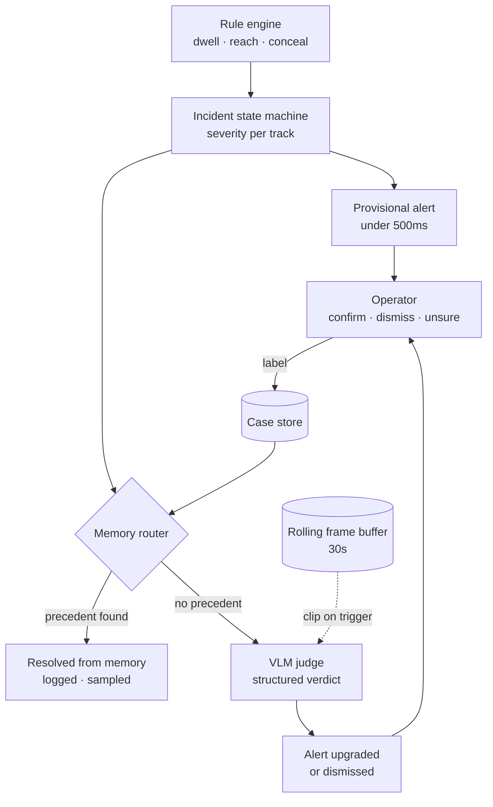

# VLM judge spike

The cascade puts a vision language model in third position. Rules fire on geometry, the incident state machine assigns severity, the memory router searches for a matching case among incidents the system has already resolved, and only cases with no precedent reach the model. By the time a clip arrives there an alert has already gone out and an operator is already looking at it. The judge decides whether that alert gets upgraded or dropped. It does not find the event.

This chapter covers a probe that asked it to do something else on purpose. Given eight frames and nothing upstream, decide whether the clip shows shoplifting. That is the wide question, it is cheaper to set up than the narrow one, and it fails loudly enough to be informative. The run moved the stage from classifier to verifier before anything was built on top of it.

## Where the judge sits



The alert leaves before the verdict exists. A model that is slow, unavailable, or wrong degrades the quality of a decision that has already been made rather than blocking it, and the operator sees the incident either way. That property is what allows the judge to be probed rather than assumed.

## Building the input

Eight frames come out of each clip at even indices across all decodable frames. Each is letterboxed into a 320x240 cell and tiled into a 4x2 grid, left to right and top to bottom, then encoded as a single JPEG at quality 90. One image goes to the model instead of eight.

Context is the reason. Eight separate images cost 4363 prompt tokens against a default context window of 4096, and the request returns 400 before the model runs at all. The same eight frames as one composite cost 1266 tokens. The grid is also read correctly as a time sequence: the model's own reasoning traces refer to frame positions within the sheet and follow people from one cell to the next.

Letterboxing rather than stretching keeps aspect ratio intact, and it turns out to be free. A composite built from 1080p footage off the project camera encodes to 194KB against 226KB for a composite built from the 320x240 corpus, because the black bars compress to almost nothing. Native camera resolution costs no extra context, which matters for the next probe.

Two prompt framings ran against the same corpus. Both share a grid header and an output block, and differ only in the task sentence.

```
You are analyzing a contact sheet showing 8 frames from a retail store security camera clip, sampled evenly in time. The frames are arranged in a 4x2 grid: read them left-to-right, top-to-bottom. The top-left frame is earliest, the bottom-right is latest.

Task: judge whether the person is committing shoplifting.

Shoplifting means concealing store merchandise on their person, in a bag, or under clothing, and moving toward or through an exit without paying. Handling, examining, or openly carrying merchandise is normal shopping behavior.

Base your judgment only on what you observe in the frames. Do not assume theft because the setting is a store.

Output rules - MUST follow exactly:
- Reply with a single JSON object and nothing after it.
- Schema: {"verdict": "theft" | "normal", "confidence": <float between 0.0 and 1.0>, "reasoning": "<one sentence, under 20 words>"}
- verdict MUST be either "theft" or "normal". No other values.
- NEVER wrap the JSON in markdown code fences.
- NEVER write anything after the closing brace.
```

The second framing replaces the task and definition lines with a single instruction: judge whether the person takes a store item and moves toward or through an exit, looking for a person picking up an item and then leaving the area with it. Header and output rules are identical.

Sampling options were fixed at temperature 0, seed 1, top_p 1.0, top_k 1. The corpus is 18 clips from UCF-Crime at 320x240, 10 labelled theft and 8 labelled normal, chosen for having temporal labels rather than for resolution.

## What the model returned

| Framing | Theft clips correct | Innocent clips correct | Total |
|---|---|---|---|
| Concealment | 0 / 10 | 8 / 8 | 8 / 18 |
| Exit | 1 / 10 | 8 / 8 | 9 / 18 |
| Answering normal every time | 0 / 10 | 8 / 8 | 8 / 18 |

The third row is the one that settles it. A stage that returns normal without looking at anything scores 8 out of 18 on this corpus. The concealment framing matches that exactly, every single one of its 18 responses was normal. The exit framing beats it by one clip. Neither result carries information about theft, and the true positive rate is effectively zero across both.

The specificity column is real but cheap. Eight out of eight on innocent clips comes free with a model that says normal to almost everything, and it should not be read as the model recognising innocent behaviour.

## The clip that answered a different question

Shoplifting039 is the only clip ever flagged, and it flagged under the exit framing alone. It is also the only clip in the corpus where the event plays out at body scale, a person walking out through a door, rather than as a hand moving near a pocket. Nine of the ten theft clips are hand-scale concealment against a person roughly sixty pixels wide, where the hand itself covers a handful of pixels. No prompt recovers information that the input does not contain.

The interesting part is what the same clip returned under the other framing. Concealment verdict: normal. Reasoning field: person openly carries bag through exit without concealing items.

The model saw the walk-out and described it accurately. It then answered normal, because the concealment question asked about a hand entering clothing and that is not what happened. Perception was correct under both framings. The verdict changed because the question changed.

That gap between what the model perceived and what it concluded is the finding this chapter exists for. Asking it to decide whether an event is theft requires it to see the scene, classify the action, and infer intent in one step, and the last of those is not a perception task at all. Asking it whether a hand is inside a bag is a perception task, and perception is the part that worked.

## How the model behaves on this host

These results concern running this class of model on a single 8GB card and are independent of what the model was asked.

Output is not reproducible at temperature 0 with a fixed seed. The model does not fit resident on this card and runs at a 29 / 71 CPU to GPU split, and the partial offload reorders floating point reductions between runs. One token diverges and the reasoning trajectory follows. A repetition check on Shoplifting039 produced 5013 and 1671 reasoning characters on back to back identical requests. Verdicts held better than the text around them, theft on five of six runs, so the conclusion is stable while the explanation is not. Anything downstream that stores the model's prose as a fact would be storing noise.

The confidence field carries nothing. Across all 36 responses it returned 0.95 thirty-three times, once 1.0, once 0.9, and once 0.0 on a response whose verdict was normal and whose reasoning was ordinary. It does not track correctness, framing, or clip. The original design intended to gate operator escalation on this number, and that path is closed.

Reasoning length drives elapsed time, and elapsed time varies far more under the exit framing than the concealment one.

| Framing | Median elapsed | Max elapsed | Median reasoning chars | Max reasoning chars |
|---|---|---|---|---|
| Concealment | 6.3 s | 9.9 s | not recorded | not recorded |
| Exit | 19.3 s | 51.1 s | 2110 | 6235 |

Token generation held near 33 per second throughout, so the spread is the model thinking longer, not stalling. The default 4096 context is the constraint that follows from this: prompt plus image sits near 1266 tokens and reasoning reaches beyond 3000, and when the two together cross the ceiling the JSON never arrives. A single retry on parse failure covers it in practice. Suppressing reasoning through the API is not available, the request field for it is ignored and the chat template produces reasoning regardless.

## Scope

The measured configuration is one model at one size and one quantization, full-frame composites at 320x240 cells built from 320x240 source, eight frames per clip, two prompt framings, 18 clips.

Not measured: the smaller model, person-cropped or wrist-centred input, native resolution source, higher frame density, and the model in the position the architecture actually gives it, behind the rule engine with precedent cases retrieved from memory supplied as context. The probe tested a primary detector. The design does not contain one.

One limitation comes from the harness rather than the model. The concealment run predates a column added to the results writer, so its output carries eight fields where the exit run carries nine, and reasoning length was not captured for it. The two framings therefore did not run against byte-identical harness code. The verdict and ground truth columns are unaffected, and the scores above stand, but the elapsed times are not strictly comparable across framings. The harness lives outside version control as throwaway spike code, so there is no history to reconstruct the difference from. Any follow-up probe belongs in the repository from the first commit.

The corpus is the leading suspect for the failure and it was chosen knowing that. Temporal labels came first and resolution came second, which was the right trade for a probe of this size and the wrong input for the question asked.

## What carries forward

The composite tile survives regardless of what model ends up behind it. It solves a context problem that any frame-sequence prompt runs into, and it costs nothing extra at native resolution.

The stage changes shape. The router already holds the geometry, it computed wrist positions, dwell duration, and the overlap that fired the rule, so it has no reason to ask an open question about a scene it already has numbers for. It asks a closed one instead, naming the fact it wants checked and fixing the answer space to a small set of tokens. A one-word answer needs no interpretation stage behind it, it drops into the incident record as a field alongside dwell time, and two incidents carrying the same fields are comparable in a way that two paragraphs are not. Several such questions per case cost less context than one open request and produce structure instead of text.

That also makes the stage measurable. Whether a clip shows theft cannot be ground-truthed reliably by a human reviewer. Whether a hand is inside a bag can be checked in a second, and a stage whose accuracy can be measured is a stage that can be regression-tested against a frozen set.

Nothing in the cascade detects theft, and the chapter should not be read as saying one stage failed to. Geometry produces a trigger, the vision stage confirms or contradicts a geometric fact the trigger inferred from keypoints, memory checks whether this pattern has been seen and dismissed before, and a person decides whether a crime occurred. That last decision stays with the operator.

The next probe changes the input before it changes anything else: the same 18 clips at native resolution, cropped around the wrist keypoints the pose model already produces, everything else held constant. If resolution was the constraint, that measurement closes the question at the source and most of the redesign behind it becomes unnecessary.
