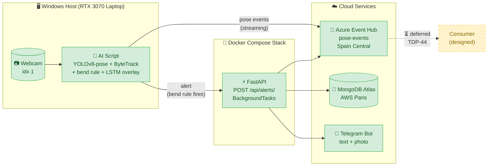

# 🎯 TheftGuard
### Real-Time AI Theft Detection Platform — Engineering Retrospective

**Author:** Nizar Kabbaj &nbsp;·&nbsp; **Period:** 1 Feb 2026 → 7 May 2026 &nbsp;·&nbsp; **Repository:** [theft-detection-platform](https://github.com/Nizar7kabbaj/theft-detection-platform)

**F1 = 0.69** &nbsp;·&nbsp; **Recall = 0.93** &nbsp;·&nbsp; **2,994 FPS inference** &nbsp;·&nbsp; **25 FPS sustained live demo**

> [!NOTE]
> **A note on timing.** The current GitHub repository was created on **29 April 2026** as a clean migration from earlier local prototyping. The Git log spans 9 days; the project itself spans **14 weeks** (1 Feb 2026 → 7 May 2026). Phases 1–3 happened in the untracked period (local code, notebooks, learning); Phases 4–5 happened in the formally tracked period. This document is honest about both.

> [!IMPORTANT]
> **Target role.** This retrospective is written as a portfolio piece for the **Ingénieur DevOps Azure Data** position at **La Vaudoise Assurances** (Switzerland). Every major technology in the offer is mapped to a phase of work in [Section 9](#9-mapping-to-the-job-offer).

---

## 📑 Table of Contents

| # | Section |
|---|---|
| 1 | [Executive Summary](#1-executive-summary) |
| 2 | [Problem and Constraints](#2-problem-and-constraints) |
| 3 | [As-Built Architecture](#3-as-built-architecture) |
| 4 | [Phase-by-Phase Narrative](#4-phase-by-phase-narrative) |
| 5 | [Performance Budget & Reproducibility](#5-performance-budget--reproducibility) |
| 6 | [Honest Limitations & Known Bugs](#6-honest-limitations--known-bugs) |
| 7 | [Risk Register for Deferred Work](#7-risk-register-for-deferred-work) |
| 8 | [Decisions I'd Reverse](#8-decisions-id-reverse) |
| 9 | [Mapping to the Job Offer](#9-mapping-to-the-job-offer) |
| 10 | [Lessons Learned](#10-lessons-learned-distilled) |
| 11 | [Closing Reflection](#11-what-this-project-taught-me-about-being-a-devops-data-engineer) |
| A | [Appendix — Ticket Index](#appendix-a--ticket-index) |
| FR | [Résumé exécutif](#résumé-exécutif-fr) |

---

## Résumé exécutif (FR)

> *À rédiger en dernier, après verrouillage de la version anglaise — environ une demi-page.*

---

## 1. Executive Summary

> *Drafting interactively — placeholder.*
>
> One-page summary covering: what TheftGuard is, the 14-week project (12 weeks foundation + 9 days formal execution), headline numbers, the deliberate Phase 5 rescoping, and the honest scope statement. Written last because it summarizes the rest.

---

## 2. Problem and Constraints

### The problem

Retail shoplifting is a **behavior-over-time problem**, not a single-frame problem. A frame from a CCTV stream rarely shows "theft" the way an image classifier wants to see it — what's visible is a sequence: approach, palm, conceal, leave. The signal lives in motion, posture, and timing, not in pixels in isolation.

This framing drove the entire technical stack. A frame-by-frame YOLO detector ("is there a person? is there a bag?") was rejected early — those questions are answered, but they don't answer "is this person *stealing*?" The chosen approach was **pose-based**: extract per-frame keypoints with YOLOv8-pose, track persons across frames with ByteTrack, feed sliding 30-frame windows into a small LSTM trained to classify normal vs. anomalous behavior.

In parallel, a deterministic **geometric rule** (sustained forward bend ≥ 60° for 2+ seconds) was kept as a separate alert path. That redundancy turned out to be the most important architectural decision in the project — see [Phase 5](#phase-5--ai-demo--honest-scope-sprint-5-3-may--7-may-formal-sprint-window) for why.

### The constraints

The project ran under three real, binding constraints.

> **Solo developer, 14 weeks of evening and weekend work.**
> No team to parallelize across, no second pair of eyes on PRs (self-review only). Every decision had to be defensible solo. The work split into two distinct rhythms: 12 weeks of unhurried research, learning, and local prototyping (Feb → late Apr), where I was figuring out *what* to build and how the pose-based approach would actually work; and 9 days of intense formal sprint execution (29 Apr → 7 May), where the cleaned-up code was migrated to a public repo, Phases 4–5 were built end-to-end, and 21 pull requests were merged. Both rhythms were necessary. The 9-day sprint would have been impossible without the 12 weeks of prep; the 12 weeks of prep would have produced nothing shippable without the 9-day sprint.

> **Laptop-class hardware.**
> RTX 3070 Laptop (8 GB VRAM), 16 GB RAM, Windows 11. Training the LSTM on the laptop would have meant 8 GB VRAM contention with Docker Desktop's WSL2 footprint and live YOLO inference. Training was offloaded to **Kaggle** (free T4, 16 GB VRAM, 30 hours/week quota). The laptop was deliberately reserved for the things it's *good* at: real-time webcam inference, the FastAPI/MongoDB/Telegram/Docker stack, and Git work.

> **Azure for Students subscription: $100 credit, 12-month window.**
> Every Azure choice was cost-aware. Event Hub Basic at 1 throughput unit (~$11/month). MongoDB Atlas free tier (M0) on AWS Paris instead of Cosmos DB — same MongoDB API surface, ~$0/month vs. ~$25/month minimum on Cosmos. The deferred Phase 6 (Terraform, AKS, APIM, Databricks) would burn the $100 budget in days at production tiers; deferring it was as much a budget decision as a scope decision.

### The framing

This is a portfolio project mapped 1:1 to the **La Vaudoise Assurances DevOps Azure Data job offer**. Every major technology in the offer (Terraform, Azure DevOps, Databricks, Power BI, Event Hub / Kafka API, AKS, APIM, Service Bus, MongoDB, Docker, Scrum) has either been built (Phases 1–5) or has a documented design with a clear resumption path (Phases 6–7). The retrospective is honest about what's built and what's planned, because a hiring manager who has shipped real systems can tell the difference at a glance.

---

## 3. As-Built Architecture

### What runs where

The **AI script** (`ai-model/scripts/detect_alert.py`) runs on the Windows host with GPU acceleration. It reads the webcam at index 1, runs YOLOv8-pose with `model.track(persist=True)` for stable person IDs across frames, computes bend angle from nose+shoulders keypoints, maintains a per-track sliding deque of 30 normalized keypoint vectors, and runs the LSTM classifier on every full window. The classifier's output colors the bounding box (🟢 NORMAL / 🔴 SUSPICIOUS) but **does not trigger alerts** — only the bend rule does.

The **backend stack** runs in Docker Compose: FastAPI + Uvicorn (`backend/`), with environment variables loaded from `backend/.env` (gitignored). The compose file uses an `override.yml` pattern — the base file is production-shaped (no source mounts), the override mounts `ai-model/outputs/snapshots/` read-only into the container so the backend can attach photos to Telegram messages. The override pattern is a deliberate choice: the same base file deploys to production unchanged.

### The alert path

When the bend rule fires:

1. AI script saves a snapshot JPEG to `ai-model/outputs/snapshots/`
2. AI script POSTs alert metadata + snapshot path to `POST /api/alerts/`
3. FastAPI writes the alert to MongoDB Atlas
4. FastAPI schedules two side-effects via `BackgroundTasks`: send Telegram message + photo, and publish event to Azure Event Hub
5. Telegram bot delivers text + photo to the **TheftGuard Alerts** group

The dual write path (FastAPI POST + Event Hub publish) is intentional during the migration window. The cleanup ticket (post-meeting) will remove the direct POST path once the deferred Event Hub consumer (TDP-44) is built.

### What this would cost in production

<table>
<tr>
<th align="left">Tier used today</th>
<th align="left">Realistic production tier</th>
</tr>
<tr>
<td>

- Event Hub Basic, 1 TU → **~$11/mo**
- MongoDB Atlas M0 → **$0/mo**
- Telegram → **$0/mo**

**Total: ~$11/mo**

</td>
<td>

- AKS (3 nodes, B-series)
- Cosmos DB (400 RU/s)
- Event Hub Standard
- APIM + Application Gateway
- Databricks (smallest cluster)
- Log Analytics + App Insights

**Estimate: ~$400–600/mo single-store**

</td>
</tr>
</table>

Per-store unit economics matter: at 100 stores the AKS cluster amortizes; at 5 stores it doesn't. This is the kind of conversation the deferred Phase 6 is designed to make defensible.

---

## 4. Phase-by-Phase Narrative

The five phases split across two distinct work periods. Phases 1–3 (Foundation, Backend & Data Layer, AI Detection Core) happened in the unhurried 12-week prototyping period from February through late April 2026 — local code, Jupyter notebooks, learning by doing, no formal Git history beyond personal scratch. Phases 4–5 (Full Integration, AI Demo & Honest Scope) happened in the 9-day formal sprint window from 29 April to 7 May 2026, when the cleaned-up code from Phases 1–3 was migrated into the public repository alongside the new work.

> Each phase below uses the same shape: 🎯 **Goal** → 🔧 **Key decisions** → 📦 **What shipped** → 🪞 **What I'd do differently**.

---

### Phase 1 — Foundation
*Sprint 1 · Feb → early Mar · untracked period*

**🎯 Goal.** Stand up the repository, the Git Flow workflow, the Python environment, and the project skeleton. No application code yet — the goal was a system that *could* receive code without breaking.

**🔧 Key decisions.**

- **Git Flow over trunk-based development.** A solo dev doesn't strictly need feature branches, but the habit matters: every change goes through a PR, every PR gets self-reviewed on the "Files changed" tab, every merge is auditable. Cost: ~5 minutes per ticket. Benefit: 21 merged PRs with zero accidental commits to `main` or `develop`, and a clean Git history that reads like a project log.
- **Branch protection on both `main` and `develop`.** Forces the PR workflow. Caught two near-misses where I would have pushed straight to `develop`.
- **`pyenv` + `venv` over Conda.** Conda is heavier than this project needs. `pyenv local 3.11.9` pinned the interpreter; `venv` isolated dependencies. Reproducibility ([Section 5](#5-performance-budget--reproducibility)) depends on this choice.
- **VS Code over Notepad for all config files.** Trivial-sounding, real consequence: Notepad on Windows defaults to Windows-1252, which silently corrupts UTF-8 config files. Found this the painful way and made it a project rule from then on.

**📦 What shipped.** Repository initialized; Git Flow branches and protection rules in place; `.gitignore` configured for Python, Node, and Docker artifacts; `requirements.txt` skeleton; README with the high-level project framing.

**🪞 What I'd do differently.** I'd add a CONTRIBUTING.md or a short "how to clone and run" snippet earlier — by Phase 4 the setup steps were scattered across PROJECT_CONTEXT.md, the README, and my head. Single source of truth from day one would have saved 30 minutes when reconstruction was needed for this retrospective.

> *Tickets: TDP-8 → ~TDP-14 (verify against Jira export).*

---

### Phase 2 — Backend & Data Layer
*Sprint 2 · March · untracked period*

**🎯 Goal.** A FastAPI backend that can receive detection events and alerts, persist them to MongoDB, and expose query endpoints for a future frontend.

**🔧 Key decisions.**

- **MongoDB Atlas (free tier M0) over self-hosted MongoDB and over PostgreSQL.** Three-way trade-off. PostgreSQL was rejected because the data is event-shaped (alerts, detections, camera metadata) — schema flexibility matters more than joins. Self-hosted MongoDB was rejected because solo dev = zero appetite for ops. Atlas free tier on AWS Paris (eu-west-3) gave me MongoDB-API-compatible storage at $0/month, with the explicit upgrade path to Cosmos DB MongoDB API (the job offer's stack) being a connection-string change.
- **FastAPI over Flask or Django.** Native async, automatic OpenAPI docs at `/docs`, Pydantic validation, BackgroundTasks for side effects. Django was overkill for an event API; Flask would have meant building the same primitives by hand.
- **Pydantic schemas in `app/models/schemas.py`, separated from data access.** Standard layered structure, but worth naming: routes → services → schemas → database. Kept the alert ingestion path clean enough that adding Event Hub publishing in Phase 5 was a 10-line change.
- **Layered config via `app/core/config.py` reading `backend/.env`.** `.env` is gitignored. `.dockerignore` explicitly excludes it from the build context — without that, a `COPY . .` in the Dockerfile would have baked the MongoDB password into every image layer. **`.dockerignore` is a security file, not a build optimization.**

**📦 What shipped.** FastAPI app with `/api/alerts/`, `/api/detections/`, `/api/cameras/`, `/api/stats/` routes; MongoDB Atlas cluster provisioned; Pydantic schemas; health check at `/health`; config layer reading `.env`; structured project layout.

**🪞 What I'd do differently.** I'd write the unique index on `alerts.alert_id` in Phase 2, not defer it to the TDP-44 design. Idempotency at the storage layer is cheap if you do it early and expensive if you retrofit it.

> *Tickets: ~TDP-15 → TDP-22 (verify against Jira export).*

---

### Phase 3 — AI Detection Core
*Sprint 3 · April · untracked period*

**🎯 Goal.** Real-time pose detection on a webcam stream, with a working "did this person bend forward suspiciously?" geometric rule. Frontend not in scope yet — this phase was about the AI loop standing up cleanly.

**🔧 Key decisions.**

- **YOLOv8-pose over MediaPipe.** Both produce keypoints; YOLOv8-pose has multi-person support out of the box and integrates with ByteTrack for persistent IDs without extra work. MediaPipe would have meant building tracking myself.
- **PyTorch CUDA 12.1 build matched to RTX 3070 driver.** Non-negotiable for GPU acceleration. CPU-only inference was tried for 5 minutes; it ran at <5 FPS. Switched to `torch torchvision torchaudio --index-url https://download.pytorch.org/whl/cu121` and got 25+ FPS immediately.
- **Bend angle from nose + shoulders, not from hips.** The deployment camera is a laptop desk camera. Hip keypoints are often occluded by the desk; nose and shoulders are reliably visible. Future production deployment with overhead retail cameras would use hips instead — the geometry is the same, the keypoint selection is camera-specific.
- **2-second sustained-bend window.** A momentary forward lean (picking up a dropped pen) shouldn't fire. Two seconds is long enough to be intentional, short enough that real concealment behavior triggers it. Tuned by hand on my own movement; future work would calibrate this against real footage.

**📦 What shipped.** `ai-model/scripts/detect.py` (raw pose loop), `ai-model/scripts/detect_alert.py` (with bend rule and snapshot saving), GPU-accelerated YOLOv8-pose pipeline at 25+ FPS on the laptop, snapshot persistence to `ai-model/outputs/snapshots/`.

**🪞 What I'd do differently.** I'd record a small calibration video set (5–10 short clips of normal vs. bend-to-conceal) during Phase 3 itself, instead of hand-tuning thresholds against my own movement. It would have made the Phase 5 evaluation more honest.

> *Tickets: ~TDP-23 → TDP-33 (verify against Jira export).*

---

### Phase 4 — Full Integration
*Sprint 4 · 29 Apr → ~3 May · formal sprint window*

**🎯 Goal.** Wire everything together. The AI script's bend events should trigger backend alerts, which should land in MongoDB, fire a Telegram message with photo, and run reliably under Docker Compose.

**🔧 Key decisions.**

- **Telegram for alert delivery, group chat with bot.** Email is too slow and noisy. SMS costs money and lacks photo support. A Telegram group is free, supports text + photo, gives the guard team a shared timeline, and is mobile-native. Bot was created via @BotFather, group chat ID confirmed as a negative integer (Telegram convention for groups), bot privacy mode disabled in BotFather so the bot can read group messages.
- **`BackgroundTasks` for Telegram and Event Hub publishes.** Notifications are *side effects* — they must not block the alert insert response. Wrapping each in `BackgroundTasks` + per-call timeouts + try/except ensures a Telegram outage doesn't fail the alert.
- **Multi-stage Dockerfile for the frontend.** Build stage installs Node deps and runs `npm run build`; runtime stage is a small nginx image serving the built bundle. Final image is ~30 MB instead of ~600 MB.
- **`docker-compose.override.yml` for dev-only mounts.** Base file is production-shaped. Override file mounts source code for hot-reload. `docker compose up` on the laptop merges both; `docker compose -f docker-compose.yml up` on a server uses only the base. **One file shape, two environments.**
- **`uvicorn --reload` ignore-list.** The reloader watches the project tree by default; outputs/ snapshot writes were retriggering reloads constantly. Fix: configure reload to ignore `outputs/`. Trivial 1-line change after a 30-minute debug.

**📦 What shipped.** Telegram bot integrated and tested end-to-end (text + photo for the small image case); `backend/Dockerfile` and `frontend/Dockerfile` written; `docker-compose.yml` + `docker-compose.override.yml`; `.dockerignore` files for both services; MongoDB Atlas connectivity verified from inside the container; `/health` endpoint reachable; full demo runnable via `docker compose up -d` + the AI script.

**🪞 What I'd do differently.** I'd write integration tests for the alert pipeline in Phase 4. The Telegram-photo path bug surfaced in Phase 5 would have been caught by a single end-to-end test that actually sent a photo and asserted Telegram's API returned 200. Manual testing missed it because the text path worked and "it sends Telegram messages" felt true.

> *Tickets: ~TDP-34 → TDP-42 (verify against Jira export).*

---

### Phase 5 — AI Demo & Honest Scope
*Sprint 5 · ~3 May → 7 May · formal sprint window*

**🎯 Goal — originally planned.** The full Azure data pipeline: Event Hub backend consumer (TDP-44), Databricks Bronze/Silver/Gold layers (TDP-45 → TDP-49), live Power BI from the Gold layer (TDP-50 / 51), Service Bus alert queue (TDP-52). All ten tickets, end-to-end from camera to Power BI.

**🎯 Goal as rescoped.** A working, defensible AI demo for an upcoming client meeting, with the data-pipeline plumbing deferred and a documented resumption path.

> [!IMPORTANT]
> This is the single most important decision in the project.

#### 🔄 The rescoping decision

Mid-sprint, with TDP-42 (Event Hub provisioning) and TDP-43 (producer) freshly merged, I had to choose: keep grinding through the pipeline (TDP-44 → TDP-52, ~8 more tickets, mostly Databricks and Power BI integration work), or pivot to a meeting-ready AI demo with honest scope disclosure.

The 9-day formal sprint window made the choice sharper than it would have been with more time. Grinding the pipeline would have left me with a half-finished Databricks workflow, no demo to show, and a meeting where the answer to "can we see it work?" was "not yet." Pivoting meant:

- Phase 5 would publicly stop short of the data pipeline
- The AI side would get more depth: real dataset, real training, real evaluation, real metrics
- The honest scope statement would have to be written and defended

I pivoted.

> *A working demo + honest disclosure beats a half-built pipeline with no demo. Hiding incompleteness is the student move; naming it explicitly with a documented design and resumption path is the engineering move.*

#### 🔧 Key decisions in the rescoped sprint

- **PoseLift dataset (TeCSAR-UNCC, WACV 2025) over CCTV-style raw video datasets.** PoseLift ships pre-extracted COCO17 keypoints with persistent ByteTrack IDs — the exact format my inference pipeline already consumes. Training on it directly tests my actual pipeline, not a separate research pipeline.
- **Trust the README, verify with the data.** PoseLift's README documents bbox format as XYWH; the actual `.pkl` files use XYXY. Caught this in TDP-87 by inspecting one frame's bbox numerically — `bbox[2] > bbox[0] + bbox[3]` is incoherent if XYWH. Cost: 20 minutes. Cost if missed: model trains on garbage coordinates and the formal sprint window collapses.
- **Supervised training on the labeled Test/ folder, deliberately mis-aligned with the dataset's unsupervised design.** Defensible only because it's disclosed: PoseLift is built for unsupervised anomaly detection on Train/ (104 unlabeled normal files), with Test/ + GT/ for evaluation. For a demo to be ready inside the formal sprint window, I needed labeled data; I used the 47 labeled Test files with 5-fold CV. Documented in `ai-model/DATASET.md`.
- **Kaggle for training, laptop for inference.** Kaggle's T4 has double my laptop's VRAM and doesn't fight Docker for resources. The trained model (`shoplifting_classifier.pt`, 0.25 MB) is small enough to commit to Git and survive across machines. Kaggle's working directory is wiped on kernel restart, so the model was uploaded as its own Kaggle dataset to survive iteration.
- **LSTM is visual-only; bend rule is the sole alert source.** The LSTM trained on overhead retail CCTV (PoseLift) flickers between NORMAL and SUSPICIOUS frame-to-frame on a laptop desk camera — real, observable domain shift. Trying to make the LSTM trigger alerts would have produced an unreliable demo. Keeping it as a visual signal (colored bounding box) and letting the camera-agnostic geometric rule own the alert path is the honest engineering choice. **Hybrid (rule + ML) with the rule owning the alert path beats pretending the ML works in conditions it wasn't trained for.**
- **Disclose AUC = 0.455 instead of hiding it.** When the LSTM's raw output distribution clusters tightly, AUC drops below 0.5 even though the F1 at threshold 0.5 stays at 0.69. Both numbers are true; both are reported in `ai-model/EVALUATION.md`. The model is calibrated for binary alerts (red/green box), not for ranking — which is what the deployment actually needs.

#### 📦 What shipped in Phase 5

- `ai-model/DATASET.md` — PoseLift selection rationale, structure verification, limitations
- `ai-model/notebooks/TDP-87_train_poselift.ipynb` — 5-fold CV training, mean F1 = 0.569 ± 0.077
- `ai-model/models/shoplifting_classifier.pt` — Fold 1 deployed model, F1 = 0.693, recall = 0.929
- `ai-model/EVALUATION.md` + `outputs/evaluation/{confusion_matrix,roc_curve}.png` + `metrics.json` + `inference_benchmark.json`
- `ai-model/scripts/predictor.py` — `ShoplifterPredictor` with per-track 30-frame sliding deque
- `ai-model/scripts/detect_alert.py` — modified for live classifier overlay, ByteTrack persistence, bend-rule-only alerting
- `ai-model/scripts/api_client.py` — backslash → forward-slash path normalization for Windows-host → Linux-container IPC
- `infrastructure/azure/EVENT_HUB.md` + `ai-model/scripts/event_hub_client.py` — Event Hub provisioned, producer working
- `docs/compliance/{README,PRIVACY,LIMITATIONS,BIAS}.md` — full TDP-91 compliance pack
- `docker-compose.override.yml` snapshots volume mount

#### 📊 Performance results

<table>
<tr>
<td align="center"><b>F1 Score</b> deployed fold  <b>0.69</b></td>
<td align="center"><b>Recall</b> intentional  <b>0.93</b></td>
<td align="center"><b>Precision</b> intentional  <b>0.55</b></td>
<td align="center"><b>Mean inference</b> RTX 3070 Laptop  <b>0.334 ms</b></td>
<td align="center"><b>Live demo FPS</b> 3000+ frames sustained  <b>25 FPS</b></td>
</tr>
</table>

#### 🪞 What I'd do differently

I'd start Phase 5 with the rescoping conversation, not arrive at it mid-sprint. The original Sprint 5 plan was visibly too ambitious for a 9-day formal sprint window; I should have caught it during sprint planning, not after merging TDP-43. The pivot was the right call; the timing of the pivot was reactive, not proactive.

I'd also build TDP-44 (the consumer) before TDP-43 (the producer). Building the producer first locked me into the dual-path architecture (FastAPI POST + Event Hub publish), which now needs a cleanup ticket post-meeting. If the consumer existed first, the AI script would only ever publish to Event Hub, and the cleanup wouldn't be needed.

> *Tickets verified from PROJECT_CONTEXT: TDP-42, 43, 85, 86, 87, 88, 89, 91 ✅ done; TDP-90, 92 🚧 in progress; TDP-34, 44–52 ⏳ explicitly deferred.*

---

## 5. Performance Budget & Reproducibility

> *Drafting interactively — placeholder.*
>
> Performance budget framing for FPS (15 FPS demo target → 25 FPS achieved, 67% headroom) and inference timing (66 ms per-frame budget → LSTM uses 0.5%). Reproducibility paragraph: pinned interpreter via pyenv, pinned deps via requirements.txt, model file committed at 0.25 MB, deterministic preprocessing documented in PROJECT_CONTEXT. Random seeds in training. One-command demo via `docker compose up -d` + `python ai-model\scripts\detect_alert.py --source 1`. Written interactively — needs your voice.

---

## 6. Honest Limitations & Known Bugs

> [!NOTE]
> This section is the **engineering counterpart** to the compliance pack in `docs/compliance/` (TDP-91). The compliance pack covers privacy, bias, and dataset limits. This section covers what's broken or not-yet-built in the engineering itself.

### 🐛 Open bugs

> [!WARNING]
> **Telegram photo path is broken under the current Docker setup.**
> Telegram text alerts arrive reliably; Telegram photos do not. Root cause is a Windows-host / Linux-container path mismatch: snapshots are saved by the AI script using Windows backslash paths (`ai-model\outputs\snapshots\foo.jpg`), and `os.path.isfile()` inside the Linux backend container returns False for that string. The fix (path normalization in `api_client.py`) was applied during TDP-89; verification across the full demo recipe is the open work item. Workaround currently used in the live demo: photo path falls back to text-only when the file resolution fails, so the alert still arrives.

**LSTM frame-to-frame flicker on the laptop desk camera.** Documented as a feature, not a bug — the LSTM is visual-only and the bend rule owns alerts — but worth naming explicitly. On a real overhead retail camera, the flicker would diminish (the training distribution would match), but that is a hypothesis, not a tested fact.

**`uvicorn --reload` shows two processes.** PID 1 is the reloader, PID 2 is the actual Uvicorn worker. Not a bug, but it confused log output during Phase 4 debugging until I understood the process tree.

### 📋 Known limitations

- **Single-camera demo.** Multi-camera fan-out is straightforward (one AI script per camera publishing to the same Event Hub) but not built or tested. Nothing prevents it; nothing demonstrates it.
- **No authentication on the FastAPI endpoints.** The `.env` ships with placeholder JWT settings (`SECRET_KEY`, `ALGORITHM`, `ACCESS_TOKEN_EXPIRE_MINUTES`) but no auth middleware is wired up. For a closed lab demo this is acceptable; for any deployed environment it is the first thing to fix. Phase 6 (TDP-58 area) covers managed identity and APIM gateway auth.
- **No CI/CD.** PRs are self-reviewed and merged manually. No GitHub Actions or Azure DevOps pipeline runs tests, builds Docker images, or scans for secrets. Phase 6 (TDP-55 area) covers this.
- **No formal test suite.** Test discipline was sacrificed for velocity inside the 9-day formal sprint window — Phases 4 and 5 prioritized shipping the integration and the demo over building test infrastructure. The only tests run are manual end-to-end ones — start the stack, trigger a bend, look at the phone. **This is the single biggest engineering debt in the project, and I name it before anyone else does.**
- **Single-store dataset.** PoseLift was captured at one retail location. Domain shift to any second store is expected. The compliance pack documents this honestly; the engineering acknowledgment is that production deployment would require either (a) per-store fine-tuning data or (b) acceptance of degraded performance in the first weeks of any new deployment.
- **Recall vs. precision asymmetry is intentional and disclosed.** F1 = 0.69 with recall = 0.93 and precision = 0.55 means roughly half the SUSPICIOUS classifications are false alarms. For a guard receiving Telegram alerts, dismissing a false alarm takes 2 seconds; missing a real theft is unrecoverable. The cost asymmetry justifies the threshold. **This is an alerting system, not an accusation system** — no automated action is taken against any individual.

---

## 7. Risk Register for Deferred Work

| Deferred area | Risk if production tomorrow | Mitigation already designed | Ticket(s) |
|---|---|---|---|
| **Event Hub consumer** | AI's direct POST is the only persistence path; if FastAPI is down, alerts are lost (no replay). | Listen-only SAS, FastAPI lifespan + `asyncio.create_task`, `$Default` consumer group, idempotency via unique index on `alerts.alert_id`. Dual-path during migration; cleanup removes direct POST after consumer is live. | TDP-44 + cleanup |
| **Databricks Bronze/Silver/Gold** | No analytics layer; raw events accumulate in Event Hub with 1-day retention. | Layer design captured in original Phase 5 plan. Bronze = raw; Silver = cleaned, schema-validated; Gold = aggregated KPIs feeding Power BI. | TDP-45 → TDP-49 |
| **Live Power BI from Gold** | Dashboard is mockup-only (TDP-90); no live data refresh. | Power BI service connection to Databricks Gold via SQL endpoint is the standard pattern; no architectural unknowns. | TDP-50, TDP-51 |
| **Azure Service Bus** | No durable alert queue; if Telegram or downstream SIEM is down, messages are lost. | Service Bus topic + subscriptions design captured in original Phase 5 plan. | TDP-52 |
| **Authentication & RBAC** | FastAPI is open; SAS keys live in `.env` files. | Phase 6 design: Azure Key Vault + managed identity for service-to-service, APIM + OAuth2 for human-facing endpoints. | TDP-58 area |
| **CI/CD** | All deployments are manual; no automated test, build, or scan. | Phase 6 design: Azure DevOps multi-stage pipelines per service, with build → test → scan → deploy gates. | TDP-55 area |
| **Observability** | No centralized logging or metrics; container logs only. | Phase 6 design: Application Insights + Log Analytics workspace; structured logging from FastAPI. | TDP-66 area |
| **AKS / production runtime** | Docker Compose only; not a production runtime. | Phase 6 design: AKS with managed identity, Helm charts per service, APIM ingress. | TDP-60 area |
| **Terraform IaC** | Manual Azure resource provisioning via portal. | Phase 6 design: full Terraform stack with remote state in Azure Storage, modules per service. | TDP-53, TDP-54 |
| **French final report** | Swiss audience reads English fine but French is appreciated. | Phase 7: French translation expansion of this retrospective. | TDP-79 |

> *The pattern across the register: every deferred item has a designed mitigation. The deferral is scope, not unawareness.*

---

## 8. Decisions I'd Reverse

> *Drafting interactively — placeholder.*
>
> Two or three honest reversals. Candidates from the narrative:
>
> 1. Build TDP-44 (consumer) before TDP-43 (producer) — would have avoided dual-path migration
> 2. Train on Kaggle from day one instead of attempting laptop training first
> 3. Add unique index on `alerts.alert_id` in Phase 2, not Phase 5
> 4. Write integration tests in Phase 4 — would have caught the Telegram photo bug
> 5. Start Phase 5 with the rescoping conversation, not arrive at it mid-sprint
>
> Pick 2–3 in interactive drafting. Need your voice for these.

---

## 9. Mapping to the Job Offer

| Job requirement (La Vaudoise) | TheftGuard implementation | Phase | Status | Evidence |
|---|---|---|---|---|
| Terraform | Full IaC for all Azure resources | 6 | ⏳ Designed | Resumption plan in PROJECT_CONTEXT; current Azure provisioning is portal-based |
| Azure DevOps | CI/CD across backend, frontend, AI scripts | 6 | ⏳ Designed | Phase 6 includes multi-stage pipelines per service |
| Databricks | Bronze/Silver/Gold layers + RBAC | 5 | ⏳ Designed | Original Sprint 5 scope; design preserved, build deferred |
| Power BI | Dashboard sourced from Gold layer | 5 | 🚧 Mockup | 6 KPIs identified (TDP-90); live wiring deferred to TDP-51 |
| Kafka Cloud | Azure Event Hub Kafka API surface | 5 | ✅ Producer | `event_hub_client.py` publishes pose events; consumer designed in TDP-44 |
| AKS | Kubernetes deployment | 6 | ⏳ Designed | Currently Docker Compose; Helm chart structure planned |
| APIM | API gateway in front of FastAPI | 6 | ⏳ Designed | Phase 6 covers OAuth2 + rate limiting |
| Azure Service Bus | Durable alert queue | 5 | ⏳ Designed | Original Sprint 5 scope |
| Azure Event Hub | Real-time pose event streaming | 5 | ✅ Shipped | Event Hub `pose-events`, 2 partitions, send-only SAS for producer |
| MongoDB | Cosmos DB MongoDB API (production target) | 2 | ✅ Shipped | MongoDB Atlas on AWS Paris; connection-string change to migrate to Cosmos |
| AI / ML | Pose-based LSTM with full evaluation | 5 | ✅ Shipped | F1 = 0.69, recall = 0.93, mean inference 0.334 ms |
| Networking (VNet, NSG, Private Endpoints) | Network isolation for Azure resources | 6 | ⏳ Designed | Phase 6 includes VNet topology |
| IAM / RBAC | Managed identities, role assignments | 6 | ⏳ Designed | Currently SAS keys; Phase 6 migrates to managed identity |
| DevSecOps | Secret scanning, SBOM, container scanning | 6 | ⏳ Designed | Phase 6 covers GitHub Advanced Security or equivalent |
| Observability | Application Insights + Log Analytics | 6 | ⏳ Designed | Currently container logs only |
| Scrum | Jira + sprints + retrospectives | All | ✅ Practiced | 5 sprints, 21 PRs, this document is the formal retrospective |
| Docker | Containerized backend, frontend; Compose | 4 | ✅ Shipped | `docker-compose.yml` + `override.yml`; multi-stage builds; `.dockerignore` discipline |
| French B2 | Final report in French | 7 | ⏳ Deferred | TDP-79 expands and translates this document |

**Legend.** ✅ Shipped &nbsp;·&nbsp; 🚧 In progress / mockup &nbsp;·&nbsp; ⏳ Designed, deferred to a documented resumption plan.

---

## 10. Lessons Learned (Distilled)

> *Drafting interactively — placeholder.*
>
> 8–12 generalizable lessons, written as prose paragraphs, not the full 67 from PROJECT_CONTEXT. Candidates (those that generalize beyond this project):
>
> 1. Demo + honest disclosure beats half-built pipeline with no demo
> 2. Domain shift is not a uniform failure — it's frame-by-frame flicker
> 3. Hybrid (rule + ML) with the rule owning the alert path is honest engineering
> 4. Backslash vs. forward slash kills cross-platform IPC — normalize at the boundary
> 5. Trust the README, verify with the data
> 6. `.gitignore` is last-rule-wins; verify with `git check-ignore -v`
> 7. PyTorch checkpoints aren't always bare state_dicts — print `list(ckpt.keys())` first
> 8. `.dockerignore` is a security file, not a build optimization
> 9. Notifications are side effects — `BackgroundTasks` + timeouts + try/except
> 10. Multi-stage Docker builds discard the build environment
> 11. Order Dockerfile from least to most frequently changing
> 12. Self-review the "Files changed" tab on every PR before merging
>
> Pick 8–12 and write as prose paragraphs in interactive drafting.

---

## 11. What This Project Taught Me About Being a DevOps Data Engineer

> *Drafting interactively — placeholder.*
>
> One page, prose, no bullets. The closing reflection. Specific, honest, slightly philosophical, grounded in TheftGuard. Needs your voice — I can draft a strong opener but you'll want to shape the substance.

---

## Appendix A — Ticket Index

> *To complete from your Jira export. Format: TDP-XX | Title | Status | One-line outcome | PR. Group by phase.*

### Phase 1 — Foundation

| ID | Title | Status | Outcome | PR |
|---|---|---|---|---|
| TDP-8 | *from Jira* | ✅ | *one-line outcome* | — |
| ... | | | | |

### Phase 2 — Backend & Data Layer

| ID | Title | Status | Outcome | PR |
|---|---|---|---|---|

### Phase 3 — AI Detection Core

| ID | Title | Status | Outcome | PR |
|---|---|---|---|---|

### Phase 4 — Full Integration

| ID | Title | Status | Outcome | PR |
|---|---|---|---|---|

### Phase 5 — AI Demo & Honest Scope

| ID | Title | Status | Outcome | PR |
|---|---|---|---|---|
| TDP-42 | Provision Azure Event Hub | ✅ | Event Hub `pose-events` running, 2 partitions, send-only SAS | #9 |
| TDP-43 | Publish pose events to Event Hub | ✅ | `ai-model/scripts/event_hub_client.py` shipped | #10 |
| TDP-85 | Choose dataset (PoseLift) | ✅ | Selection rationale in `ai-model/DATASET.md` | #11 |
| TDP-86 | Set up Kaggle notebook | ✅ | PoseLift loaded and verified on Kaggle T4 | #12 |
| TDP-87 | Train pose-based LSTM | ✅ | `shoplifting_classifier.pt` deployed, mean F1 = 0.569 ± 0.077 (5-fold CV) | #13 |
| TDP-88 | Evaluate model — metrics + inference time | ✅ | `ai-model/EVALUATION.md`, F1 = 0.69, recall = 0.93, mean 2,994 FPS | #19 |
| TDP-89 | Live webcam classifier overlay | ✅ | `predictor.py` + `detect_alert.py` modifications, 25 FPS sustained | #20 |
| TDP-90 | Power BI dashboard mockup (6 KPIs) | 🚧 | In progress | — |
| TDP-91 | Compliance pack (privacy, bias, limitations) | ✅ | `docs/compliance/` | #21 |
| TDP-92 | Phase 1–5 retrospective | 🚧 | This document | — |
| TDP-34 | *Phase 5 deferred ticket* | ⏳ | Documented in resumption plan | — |
| TDP-44 | Event Hub backend consumer | ⏳ | Design preserved in PROJECT_CONTEXT | — |
| TDP-45–49 | Databricks Bronze/Silver/Gold | ⏳ | Original Sprint 5 scope | — |
| TDP-50, 51 | Power BI live from Gold | ⏳ | Mockup version covers TDP-90 | — |
| TDP-52 | Service Bus alert queue | ⏳ | Original Sprint 5 scope | — |

### Phase 6 — Azure Deployment (deferred, designed)

| ID | Title | Status |
|---|---|---|
| TDP-53 → TDP-72 | Terraform, Azure DevOps, AKS, APIM, observability, etc. | ⏳ Deferred |

### Phase 7 — Documentation & Portfolio

| ID | Title | Status |
|---|---|---|
| TDP-73 → TDP-84 | ADRs, French final report, CV materials, demo video, presentation | ⏳ Deferred |

---

*End of retrospective.*

Sections 1, 5, 8, 10, 11, and the French executive summary remain to be drafted interactively.
Ticket index appendix to be completed from Jira export.

**[⬆ Back to top](#-theftguard)**

